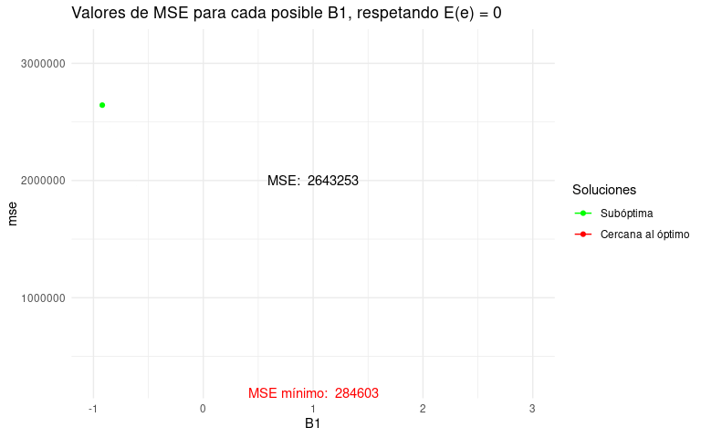
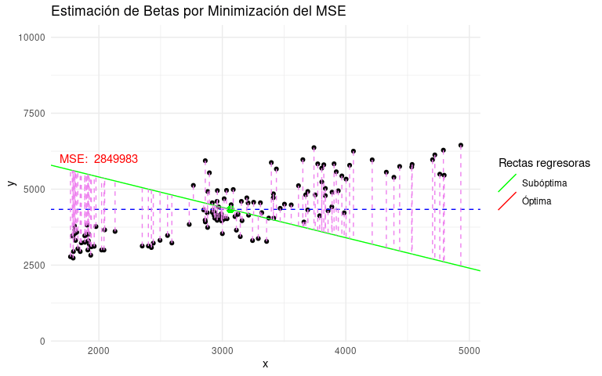

```{=html}
<script type="text/x-mathjax-config">
MathJax.Hub.Config({
  TeX: { equationNumbers: { autoNumber: "AMS" } }
});
</script>
```
<div>


</div>

```{r include=FALSE}
knitr::opts_chunk$set(
  warning = FALSE,
  echo = TRUE,
  message = FALSE,
  options(scipen=999)
)

# Librerías
library(tidyverse)
library(janitor)
library(openxlsx)
library(flextable)
# library(kableExtra)
library(viridis)
library(scales)
library(DT)
library(lubridate)
library(gridExtra)
library(ggplot2)
library(gganimate)
library(animation)
library(gifski)
library(magick)
library(nortest)
library(fitdistrplus)

```

# INTRODUCCIÓN

## DOCENTES

### Héctor Hernán Montes García.

Ingeniero industrial de la Universidad Tecnológica de Pereira.

Estudios en Maestría en Ciencias con orientación en Matemáticas

[Desempeño laboral]{style="color: red;"}

Científico de datos con más de 3 años de experiencia en la construcción
de modelos de aprendizaje automático y soluciones de minería de datos
para obtener mejores conocimientos comerciales. Experiencia utilizando
SQL, bibliotecas de Python (matplotlib, seaborn, flask, scikit-learn,
pandas, numpy), modelos matemáticos y estadísticos para ofrecer
soluciones robustas que agregan valor al negocio.

Ha trabajado para clientes del sector industrial y financiero en México
y Colombia, en áreas tales como:

-   Mantenimiento predictivo
-   Diseño de campañas comerciales basadas en datos
-   Reconocimiento de imágenes
-   Modelos de procesamiento de lenguaje natural (NER).

### Julián Piedrahíta Monroy

Ingeniero industrial.

Magíster en desarrollo agroindustrial

Universidad Tecnológica de Pereira

[Desempeño laboral]{style="color: red;"}

-   Consultor en soluciones análiticas para instituciones educativas.
-   Analista de datos en el observatorio social de la UTP.
-   Actualmente diseñador de tableros informativos (dashboards) para la
    Universidad Pedagógica Nacional de Bogotá y la misma Universidad
    Tecnológica de Pereira.
-   Docente catedrático en el área de informática y estadística general.
-   Uso principal del lenguaje R y sus librerias Tidyverse, RMarkdown,
    RShiny y otras.

## Contenido del curso

-   T1. Regresión Lineal, suposiciones y requisitos.
-   T2. Estimación de los parámetros e interpretación de los valores.
-   T3. Pruebas de hipótesis relacionadas con los parámetros.
-   T4. Evaluación de modelos de acuerdo a las suposiciones de
    normalidad e independencia.
-   T5. Transformaciones de las variables, y sus implicaciones en las
    pruebas de hipótesis.
-   T6. Series de Tiempo. Estacionariedad y cómo obtener una serie
    estacionaria a partir de una que no lo es. Correlogramas.
-   T7. Modelos de Box y Cox. Estimación de parámetros.
-   T8. Criterios de evaluación de un modelo de series de tiempo.
    Transformaciones.

## Bibliografía.

Regression Modeling and Data Analysis with Applications in R. Samprit
Chatterjee, Jeffrey S. Simonoff\
Montgomery, D. C., Peck, E. A., & Vining, G. G. (2002). Introducción al
análisis de regresión lineal (3ª ed.). Limusa Wiley.\
Time Series Analysis and Its Applications: With R Examples by Shumway
and Stoffer.\
Time Series Analysis: Forecasting and Control by Author(s): George E. P.
Box, Gwilym M. Jenkins, Gregory C. Reinsel, Greta M. Ljung.\
<https://fhernanb.github.io/libro_regresion/rls.html#modelo-estad%C3%ADstico>\
<https://bookdown.org/victor_morales/SeriesdeTiempo/>

## Motivación

Los métodos de regresión son técnicas estadísticas utilizadas para
modelar y comprender la relación entre variables. La motivación detrás
de estos métodos radica en la necesidad de analizar y cuantificar cómo
una o más variables predictoras influyen en una variable respuesta. Los
métodos de regresión son ampliamente utilizados en diversos campos,
incluyendo la investigación científica, la economía, la medicina, la
ingeniería y más. A continuación, se detallan algunas de las principales
motivaciones detrás de estos métodos:

<figure>


<figcaption>Img 1: Ejemplo de fenómeno lineal</figcaption>

</figure>

[Modelado de Relaciones:]{style="color: red;"}

La motivación fundamental de la regresión es modelar la relación entre
variables. En muchos casos, existe la necesidad de entender cómo una
variable dependiente cambia en función de una o más variables
independientes. Por ejemplo, en la economía, podría ser necesario
entender cómo las tasas de interés afectan el gasto del consumidor.

[Predicción y Estimación:]{style="color: red;"} Los modelos de regresión
también se utilizan para hacer predicciones y estimaciones. Dado un
conjunto de datos históricos, los modelos de regresión pueden ayudar a
predecir valores futuros de la variable dependiente en función de los
valores de las variables independientes. Esto es especialmente útil en
campos como la meteorología, la finanzas y el marketing.

<figure>


<figcaption>Img 2: Prediciendo la tendencia histórica del
S&P</figcaption>

</figure>

[Control y Optimización:]{style="color: red;"} En algunos casos, se
utilizan modelos de regresión para optimizar y controlar procesos. Por
ejemplo, en la manufactura, los modelos de regresión pueden usarse para
identificar las condiciones ideales que conducen a la máxima eficiencia
o calidad del producto.

[Validación de Teorías:]{style="color: red;"} En la investigación
científica y social, los modelos de regresión pueden usarse para validar
o refutar teorías existentes. Al comparar los resultados del modelo con
las expectativas teóricas, se puede evaluar la validez de las hipótesis.

[Gestión de Riesgos:]{style="color: red;"} Los modelos de regresión
también se utilizan para evaluar riesgos y tomar decisiones informadas.
En finanzas, por ejemplo, se pueden utilizar para evaluar el riesgo de
inversión y la exposición a diferentes factores del mercado.

**Ejemplo**

El modelo CAPM (Capital Asset Pricing Model) es un modelo de valoración
de activos financieros desarrollado por William Sharpe que permite
estimar su rentabilidad esperada en función del riesgo sistemático. Su
desarrollo está basado en diversas formulaciones de Harry Markowitz
sobre la diversificación y la teoría moderna de portafolios. Dos puntos
claves son:

1.  El modelo CAPM es utilizado para calcular la rentabilidad que un
    inversionista debe exigir al realizar una inversión en un activo
    financiero en función del riesgo que está asumiendo.
2.  El modelo CAPM establece una relación lineal entre el rendimiento
    esperado de un activo y su riesgo sistemático, medido por su
    $\beta_i$.

La fórmula del modelo CAPM es la siguiente:

$E(r_i)=r_f+\beta_i*(E(r_m)-r_f)$

Donde:

$E(r_i)$ es la tasa de rentabilidad esperada de un activo concreto. $rf$
es la rentabilidad del activo sin riesgo. $\beta_i$ es la medida de la
sensibilidad del activo respecto a su benchmark. $E(r_m)$ es la tasa de
rentabilidad esperada del mercado en que cotiza el activo.

<figure>

\

<figcaption>Img 3: Modelo CAMP para valoración de activos
financieros</figcaption>

</figure>

[Análisis de Causa y Efecto:]{style="color: red;"} Los modelos de
regresión pueden ayudar a establecer relaciones causa-efecto entre
variables. Esto es útil para comprender cómo los cambios en una variable
influyen en otras variables y viceversa.

<figure>


<figcaption>Img 4: Predicción de rendimientos de cultivos</figcaption>

</figure>

En resumen, la motivación detrás de los métodos de regresión radica en
la necesidad de entender, modelar, predecir y cuantificar las relaciones
entre variables en una variedad de campos. Estos métodos permiten tomar
decisiones informadas, realizar análisis profundos y obtener información
valiosa a partir de los datos disponibles.

# 1. INTRODUCCIÓN NO FORMAL AL MODELO LINEAL SIMPLE

En este capítulo introduciremos el modelo lineal simple partiendo de
datos reales del precio del aguacate y el precio del dólar. Más que una
presentación formal o matemática del modelo, nuestro objetivo será
construirlo paso a paso usando las ideas estadísticas detrás del método.
Confiamos en que esto le al lector una idea más precisa de cómo éste
modelo usa los datos dados para relacionar las variables de inteŕes, y
que comprenda sus fortalezas pero también sus limitaciones.

## 1.1 Lectura de datos

A continuación, cargaremos dos tablas de datos que contienen información
sobre el precio del dolar, también conocida como tasa representativa del
mercado, y otra con la información del precio del aguacate Hass tomada
de una fuente gubernamental y de la página del SIPSA.

Los enlaces para acceder a información relacionada son:

<https://www.agronet.gov.co/estadistica/Paginas/home.aspx?cod=11>
<https://www.bde.es/webbe/es/estadisticas/temas/tipos-cambio.html>

```{r}
# Cargue y limpieza de datos.

dolar <- read.csv2("datasets/Tasa_de_Cambio_Representativa_del__Mercado_-Historico.csv") %>% 
  clean_names()
hass <- read.xlsx("datasets/Hass_Precios_Historicos.xlsx") %>% clean_names()
```

## 1.2 Creación de funciones.

Se programa una función de flextable que mejorará la impresión de tablas
de resumen. Para usarla sólo bastará invocar la función ftable() al
final de la sentencia (usando %\>% tidyverse) o con el ftable()
encapsular o encerrar la tabla que se quiere ajustar.

```{r}
# Funciones

## Función para crear flextable
ftable <- function(x) {
  x %>% 
    flextable() %>% 
    theme_vanilla() %>%
    color(part = "footer", color = "#666666") %>%
    color( part = "header", color = "#FFFFFF") %>%
    bg( part = "header", bg = "#2c7fb8") %>%
    fontsize(size = 11) %>%
    font(fontname = 'Calibri') %>%
    # Ajustes de ancho y tipo de alineación de las columnas
    set_table_properties(layout = "autofit") %>% 
    # width(j=1, width = 3) %>%
    align(i = NULL, j = c(2:ncol(x)), align = "right", part = "all")
}
```

Como ejemplo del uso de la función:

*Sin flextable*

```{r}
dolar %>% 
  head(5) 
```

*Con flextable*

```{r}
dolar %>% 
  head(5) %>% 
  ftable()
```

## 1.3 Depuración de los datos

### Dolar

Como en todo proceso de análisis de datos, es necesario realizar una
depuración y ajuste de los datos. Para este caso, fue necesario trabajar
sobre la variable de la fecha y el valor.

```{r}
# Vamos a sacar un valor promedio de cada variable por mes
#Para el dolar vamos a tomar el campo vigenciadesde

dolar <- dolar %>% 
  mutate(fecha = as.Date(vigenciadesde, format = "%d/%m/%y")) %>% 
  mutate(mes = month(fecha), anio = year(fecha)) %>% 
  mutate(valor = as.double(str_replace(valor,",",""))) %>% 
  group_by(anio,mes) %>%
  summarise(precio_dolar = mean(valor), .groups = "drop") 
```

A continuación se muestra una fracción de los datos depurados.

```{r}
dolar %>%
  datatable()
```

### Aguacate

```{r}
hass %>% 
  head(5) %>% 
  ftable()
```

```{r}
# 🖇️ Se genera el vector de meses para usarlo más abajo con la función match.
meses <- c("Enero", "Febrero", "Marzo", "Abril", "Mayo",
           "Junio", "Julio", "Agosto", "Septiembre", "Octubre",
           "Noviembre", "Diciembre")

hass <- hass %>% 
  # Otra forma de sacar el anio.
  #mutate(anio = substring(fecha,nchar(fecha)-4,nchar(fecha))) %>% 
  #mutate(espacio = grepl(", ",fecha))
  mutate(mes = sapply(strsplit(fecha, " "), "[", 2),
         anio = sapply(strsplit(fecha, " "), "[", 5)) %>% 
  mutate(anio = as.double(anio)) %>% 
  # 🖇 Se utiliza la función match con el vector meses.
  mutate(mes = match(mes,meses)) %>% 
  group_by(anio,mes) %>%
  summarise(precio_aguacate_kg = mean(precio_kg), .groups = "drop") 
```

```{r}

hass %>% datatable()

```

### Datos unidos

```{r}

hass_dolar <- dolar %>% 
  right_join(hass, by = c("mes","anio")) 

hass_dolar %>% 
  head(5) %>% 
  ftable()
```

## 1.4 Diagrama de dispersión.

```{r}
hass_dolar %>% 
  ggplot(aes(x= precio_dolar, y= precio_aguacate_kg )) +
  geom_point()+ theme_light()
```

Cómo se puede notar uno intuye que hay alguna relación entre ambas
variables en la medida en que parece suceder que cuando el precio del
dólar aumenta, también lo hace el precio de aguacate. La relación no es
perfecta pues no vemos una curva suave que sea capaz de pasar por todos
los puntos, más bien debemos reconocer que hay ciertas variaciones en el
proceso. Estas variaciones pueden deberse a factores no contemplados por
el modelo, después de todo no podemos esperar que el precio del aguacate
dependa exclusivamente del precio del dólar.

## 1.5 Generando un modelo súper simplificado (modelo ingenuo)

Ahora vamos a generar el modelo más sencillo que podamos imaginar para
predecir el precio del aguacate, al cual llamaremos un modelo ingenuo.
La razón del apelativo es que el modelo "ingenuamente" supondrá que es
posible predecir el precio que tendrá el aguacate con el promedio
histórico.

La siguiente gráfica muestra la linea horizontal que simboliza el
promedio histórico del precio del aguacate. También debe notar que
predecir basado en esta línea es despreciar cualquier aporte de la
variable precio del dólar en la predicción, es decir, es un modelo que
no explota la relación (sea esta débil o sea esta fuerte) entre el
precio del aguacate y su variable explicativa precio del dólar.

```{r}
hass_dolar %>% 
  ggplot(aes(x= precio_dolar, y= precio_aguacate_kg )) +
  geom_point()+ 
  geom_hline(yintercept = mean(hass_dolar$precio_aguacate_kg), color = "red")+
  geom_text(aes(x= 5700, y = mean(hass_dolar$precio_aguacate_kg),
                label = paste("Precio promedio histórico: $",
                              round(mean(hass_dolar$precio_aguacate_kg), 2))),
            hjust = 1.2, vjust = -0.2, color = "red"
  ) +
  theme_light()
```

Observe que el modelo ingenuo no sería tan inadecuado en dos
circunstancias:

-   Si los datos se encuentran muy cercanos al precio histórico de
    manera consistente sin importar en que valor del precio del dólar me
    posicione. Lo que vendría a indicar un escenario donde moverme a lo
    largo de diferentes valores del precio del dólar no genera ningún
    patrón de distanciamiento frente al valor histórico de referencia.

-   Si los datos del precio del aguacate se alejan de la línea histórica
    de referencia pero el precio del dólar tampoco puede seguirlos, es
    decir, si la relación entre precio del dólar y precio del aguacate
    se parece a una nube de puntos sin ningún patrón o tendencia
    evidente. En este caso cualquier cosa que supongamos de la relación
    entre precio de dólar y precio del aguacate será producto de nuestra
    imaginación 🤦🤦

En estos dos escenarios es mejor retener el modelo ingenuo a falta de
una variable que de verdad explique lo que pasa con el precio del
aguacate.

Ahora bien, ninguno de los dos escenarios anteriores parece ser el
nuestro, más bien acá se nota que el precio del dólar si está acompasado
con el precio del aguacate. Sin embargo antes de entrar en la búsqueda
de esas relaciones es importante notar dos cosas:

-   El modelo ingenuo es mi modelo de referencia, esto significa que si
    un modelo predictivo construido para predecir el precio del aguacate
    es mejor, lo tendrá que ser respecto a este modelo ingenuo.

-   Es posible medir el desajuste actual de mi modelo ingenuo tomando la
    distancia de cada punto a la recta horizontal de promedio histórico,
    esto es:

## 1.6 Calidad de ajuste del modelo ingenuo

Sea $e_i = y_i - \bar{y}$ las diferencia entre el dato del precio de
aguacate $y_i$ y el promedio histórico $\bar{y}$. Como tengo muchas
diferencias, será necesario definir una métrica resumen, por
conveniencia elijamos la suma de los cuadrados de las diferencias,
debido a que si sumamos las diferencias, éstas se me compensarán, pues
diferencias negativas cancelarán las positivas, y no quiero esto. Más
bien me interesa que ambas sumen a mi medida de desajuste. Llamemos a
esta medida la suma de cuadrados del error:

$$SCE_{\text{ingenuo}} = \sum^{n}_{i=1}e_i²=\sum^{n}_{i=1}(y_i - \bar{y})²$$

En la definición de la cantidad quisimos usar el subíndice "ingenuo"
para nombrar al SCE, esto con el fin de hacer énfasis que tal métrica se
asocia al modelo, si el modelo cambia a otro tipo de modelo el SCE
cambiará también: será la distancia de cada $y_i$ a la curva definida
por el otro modelo. Veremos esto más adelante. No obstante ya podemos
sacar nuestras primeras conclusiones:

1.  Entre más grandes sean cada una de las distancias $e_i$
    individuales, más grande será SCE.
2.  Todas las distancias contribuyen con igual importancia al SCE,
    excepto en lo que se refiere a su magnitud no hay porque pensar que
    un distanciamiento de $u$ unidades sea más importante que otro de
    las mismas $u$ unidades. Esto puede ser obvio pero no lo es cuando,
    por ejemplo, queremos castigar más las distancias que se dan en la
    zona central del gráfico que las que se dan en los extremos del
    gráfico.
3.  El SCE es sensible a la cantidad de datos, razón por la cual entre
    más datos (es decir entre más grande sea n), más grande será SCE.
    Esto dificulta seriamente la posibilidad de comparar modelos que
    fueron calculados sobre una cantidad distinta de puntos.

De acuerdo con lo anterior modifiquemos un poco nuestra definición de
desajuste, así:

$$MSE_{\text{ingenuo}} =  \color{red}{\frac{1}{n}}\sum^{n}_{i=1}(y_i - \bar{y})²$$

Es decir, nuestra medida de desajuste será el promedio de la suma de las
diferencias cuadradas de cada dato $y_i$ respecto a su media $\bar{y}$,
dicho de otra manera la varianza de la variable $Y$ a predecir!!!!

A continuación invitamos al estudiante a calcular la varianza de la
variable a predecir, es decir, el desajuste del modelo ingenuo.

```{r}

# En esta sección el estudiante desarrollará los cálculos.

# 💡 Recordemos que la varianza de los residuales respecto del modelo ingenuo, es la misma varianza de la variable a predecir.


```

Observe el siguiente gráfico en el que hemos pintado las distancias que
hay entre cada dato $y_i$ observado y el promedio histórico (valor
predicho $\bar{y}$ por el modelo ingenuo)

```{r}
hass_dolar %>% 
  ggplot(aes(x= precio_dolar, y= precio_aguacate_kg )) +
  geom_point()+ 
  geom_hline(yintercept = mean(hass_dolar$precio_aguacate_kg))+
  geom_segment(aes(xend=precio_dolar, yend=mean(precio_aguacate_kg)),
               col='red', lty='dashed')+
  theme_light()
```

## 1.7 Construyendo un modelo lineal simple con los datos

Este es el momento de comenzar a usar la información extra con la que
contamos, esto es, el precio del dólar, el cual se convertirá en una
variable predictora del precio del aguacate. En estadística no hay una
única forma de hacer esto, pero lo usual es partir de especificaciones
muy sencillas. Veamos:

Sea $Y$ el precio del aguacate y sea $X$ el precio del dólar.
Investiguemos si este modelo sencillo nos funciona:

$$y = \beta_{0} + \beta_{1} * x + e \text{ con } e \text{~}N(0, \sigma^2)$$

## 1.8 Algunas observaciones sobre las fortalezas y limitaciones del modelo

Expliquemos qué implica la ecuación anterior haciendo ciertas
anotaciones de gran relevancia práctica para entender **cómo los
estadísticos piensan al momento de plantear modelos**:

[Observación genial 1:]{style="color: red;"}

Para un x fijo, es decir un x dado, es posible calcular el valor de $y$
con el modelo anterior, donde tácitamente estamos diciendo que el valor
de $y$ dependerá de $x$ en forma exacta, excepto por una perturbación
aleatoria $e$ que representará la parte del valor de $y$ que no puede
ser capturada por el término $\beta_{0} + \beta_{1} * x$.

¿Cuándo sucederá que el valor de $y$ pueda ser exactamente capturado por
el término $\beta_{0} + \beta_{1} * x$? Cuando $y$ dependa en forma
lineal exacta del valor de $x$. Esta es una condición demasiado fuerte
que rara vez ocurre en la práctica, por eso agregamos la perturbación
$e$ como una forma de modelar la **incertidumbre** en la determinación
de $y$ dado un valor de $x$. Esto no soluciona todos los problemas pero
ayuda a obtener un modelo relativamente más realista.

[¿Cuáles son los riesgos que implica asumir a priori un comportamiento
específico para el error?]{style="color: red;"}

[Observación genial 2:]{style="color: red;"}

La perturbación $e$ puede recibir varios nombres en estadística, la
encontrarás nombrada como: perturbación, choque, error, o residual. Lo
importante no es el nombre que reciba, sino las condiciones que vamos a
suponer sobre sus valores.

En particular no vamos a exigir que $e$ tenga valores predecibles, muy
al contrario vamos a exigir que sea un valor aleatorio, precisamente
porque está modelando incertidumbre. Pero esto no implica que no podamos
poner ciertas condiciones sobre el **tipo de aleatoriedad deseada para**
$e$. En este caso supondremos que $e$ se distribuye como una variable
aleatoria normal con media $\mu=0$ y desviación estándar $\sigma$.
Conviene aclarar que esto es una suposición, no implica que
efectivamente los errores vayan a cumplir tal supuesto.

[Observación genial 3:]{style="color: red;"}

¿Por qué suponemos normalidad para $e$? Porque si $e$ es en efecto una
especie de componente incierto en el valor de $y$, entonces muy
seguramente será la suma de muchos efectos independientes que lo están
provocando. En nuestro contexto estos efectos inciertos pueden ser:

-   $F_1$: Cambios en la productividad de los cultivos.
-   $F_2$: Condiciones climatológicas.
-   $F_3$: Precios de los insumos agrícolas.
-   $F_4$: Capacidad de negociación de los productores.
-   $F_5$: Presencia o no de subsidios estatales.
-   $F_6$: Precios de productos complementarios o sustitutos.

...

-   $F_k$: precio de la gasolina.

Y un gran etcétera.

Es decir, existen innumerables factores, distintos al precio del dólar
que impiden que el precio del aguacate pueda ser determinado de forma
exacta sólo por observar el valor del dólar. En estadística se ha
estudiado que cuando no estamos midiendo los demás factores que afectan
el valor de una variable, y dejamos que estos contribuyan de forma
desacoplada e independiente a dicho valor, el efecto general $e$ que
resume el efecto global de todos los factores a la vez, suele
comportarse bajo la **distribución normal** sencillamente porque hay un
teorema en matemáticas, conocido como el Teorema del Límite Central que
básicamente así lo garantiza, al postular que: ***la suma de*** $k$
***efectos aleatorios independientes tiende a adoptar el comportamiento
normal conforme la cantidad k de efectos crece***.

Es importante destacar que el Teorema del Límite Central tiene algunas
condiciones y suposiciones, como la independencia de las variables
aleatorias y que la suma debe efectuarse sobre una cantidad $k$ de ellas
suficientemente grande. Éste es uno de los conceptos fundamentales en
estadística y es ampliamente utilizado en la teoría y la práctica de
esta disciplina.

[Observación para nada genial 4 😥😢:]{style="color: red;"}

Excepto por el componente aleatorio $e$, el modelo restringe la relación
de $Y$ y $X$ al universo de relaciones lineales. Existirá una posible
relación por cada par de valores $\beta_0$ y $\beta_1$ que decidamos
elegir. Pero por más que nos esforcemos en modificarlos siempre
conducirán a relaciones representadas por líneas rectas, de ahí que el
modelo asuma el nombre de regresión lineal.

Si queremos capturar otras posibles dependencias de $Y$ respecto a $X$
podemos generalizar la relación usando $y = f(x) + e$ donde $f(x)$ puede
ser una nueva especificación funcional con otra estructura deseada, por
ejemplo un polinomio o cualquier otra función que querramos definir. Lo
importante es que detrás de la definición de $f(x)$ haya alguna
justificación producto de haber analizado los datos en búsqueda de
relaciones que capturen bien la dependencia.

[Observación genial final:]{style="color: red;"}

Son los datos observados para cada valor de $y$ y $x$ los que nos deben
informar sobre el par de valores $\beta_0$ y $\beta_1$ que crean la
relación lineal que mejor representa nuestra nube de puntos, pero de
nada sirven los valores observados si no definimos una métrica que nos
informe sobre la calidad del ajuste.

## 1.9 Introducción a las medidas de ajuste para modelos no ingenuos

De la observación final del apartado anterior nos queda una inquietud:
¿Cómo decidimos el par de valores a asignar a los parámetros del modelo
lineal si no tenemos un criterio para poder saber cuál es el mejor
modelo?

Para salir de este embrollo, reconozcamos que nunca en un problema real
sujeto a incertidumbre una recta pasará exactamente por todos los
puntos, razón por la cual aparecerán componentes de error $e_i$ por cada
$y_i$ y $x_i$ observado. Vimos que esto ocurrión con el modelo ingenuo y
por supuesto ocurre también para un modelo no ingenuo. La idea es
entonces reducir la magnitud de estos errores al mínimo posible y el par
de valores $\beta_1$ y $\beta_2$ que así lo logren será nuestra elección
óptima de cara al objetivo de minimización del error.

Otro criterio de ajuste que se podría usar es el de maximizar la
probabilidad de ocurrencia de los valores observados bajo el supuesto de
que el modelo usa valores $\beta_0$ y $\beta_1$ previamente
especificados. De esta manera si un par de valores hace menos probable
haber obtenido nuestros datos observados deberán descartarse.

¿Pero cómo podemos medir la probabilidad de ocurrencia de nuestros datos
observados una vez damos valores específicos para los betas? Esta es una
cuestión que se tratará más adelante cuando discutamos los **métodos de
estimación de parámetros**, nombre con el que se conoce al procedimiento
estadístico encaminado a elegir los mejores betas para un conjunto de
datos observados.

Por lo pronto vamos a proceder de manera más intuitiva, dejando de lado
el formalismo matemático, y vamos a ejemplificar un posible modelo
ajustado usando valores $\beta_0=700$ y $\beta_1 = 1.2$. Hemos elegido
estos valores por simple inspección visual así que no esperamos que sean
óptimos en ningún sentido, veamos:

```{r}

# Calculamos las predicciones de "y" usando el modelo
b0 = 700
b1 = 1.2
x= hass_dolar$precio_dolar
y_pred = b0 + b1*x

hass_dolar %>% 
  ggplot(aes(x= precio_dolar, y= precio_aguacate_kg ))+
  geom_point() +
  geom_line( aes( x= x, y = y_pred), col = "red")
```

Aunque no estamos seguros de la optimalidad de los betas elegidos, el
ajuste basado en este modelo es a simple vista decente, pero no
deberíamos depender de esto. Es necesario usar las herramientas que R
nos ofrece para estimar los betas. Antes de pasar a su uso ciego,
revisemos en qué consideraciones estadísticas se basan estos métodos.
Para ello definamos primero los errores cometidos por el modelo, y más
aún, la medida de desempeño que usaremos para decidir cuál es la mejor
elección de los betas. Usaremos entonces la métrica MSE(Mean Squared
Errors) dada por:

$$MSE_{\text{NO ingenuo}} =  \frac{1}{n}\sum^{n}_{i=1}e_i²$$

Por otro lado podemos decir que $e_i = y_i - \hat{y}$, donde la cantidad
$\hat{y}$ representa el valor de la variable $Y$ que arroja el modelo,
el cual es por regla general diferente al verdadero valor observado de
$Y$, es decir, los errores son las diferencia de lo observado $y_i$ y lo
predicho por el modelo basado en la recta $\hat{y}$, por lo tanto:

$$MSE_{\text{NO ingenuo}} =  \frac{1}{n}\sum^{n}_{i=1}(y_i - \hat{y})²$$

Y más específicamente:

$$MSE_{\text{NO ingenuo}} =  \frac{1}{n}\sum^{n}_{i=1}(y_i - (\beta_0 + \beta_1*x_i))²$$
$$MSE_{\text{NO ingenuo}} =  \frac{1}{n}\sum^{n}_{i=1}(y_i - \beta_0 - \beta_1*x_i)²$$

Con esta expresión ya se hace patente que $MSE_{\text{NO ingenuo}}$ es
función de los pares de valores $(x_i, y_i)$ a los que se debe ajustar
la recta, así como de los valores que elijamos para los betas.

Sin embargo, como los pares $(x_i, y_i)$ ya vienen dados por nuestra
base de datos o, hablando en términos más generales, por la información
recaudada para la construcción del modelo, sólo tendremos opción de
variar los betas en aras de minimizar la cantidad
$MSE_{\text{NO ingenuo}}$. Dicho de otra manera los pares de valores
$(x_i, y_i)$ **se comportan como constantes** a lo largo de mi proceso
de minimización.

Dado lo anterior, es buena idea definir una función MSE en R que permita
calcular, para diferentes elecciones de los betas, la medida de
desempeño. Esta medida de desempeño es conocida también en la literatura
como función de pérdida, queriendo indicar con ello una pérdida de
ajuste del modelo a los datos. Es importante aclarar que no existe una
única elección para la función de pérdida de un modelo predictivo, otras
alternativas típicas son la mediana de las desviaciones absolutas
(MEDA), la media de los errores absolutos (MAE), entre otros. Sin
embargo en regresión lineal es usual usar MSE porque su expresión como
cuadrado de errores permite usar teoría de inferencia basada en la
distribución F cuando los errores se asumen normales. Veremos esto más a
detalle cuando discutamos pruebas de hipótesis sobre el modelo de
regresión.

## 1.10 Una relación importante entre los betas del modelo lineal

Retomando nuestro modelo original

$$y = \beta_{0} + \beta_{1} * x + e \text{ con } e \text{~}N(0, \sigma^2)$$

Tomando valor esperado en ambos lados de la ecuación tenemos que:

$$E(y) = E(\beta_{0} + \beta_{1} * x + e)$$ Pero como $\beta_0$ y
$\beta_1$ son constantes, tenemos que:

$$E(y) = E(\beta_0) + E(\beta_1*x) + E(e)$$ Así que:

$$E(y) = \beta_0 +\int_{-\infty}^{\infty}\beta_1 *xf(x)dx + E(e)$$
$$E(y) = \beta_0 + \beta_1*\int_{-\infty}^{\infty}xf(x)dx + E(e)$$ Y
como $\int_{-\infty}^{\infty}xf(x)dx$ es por definición $E(x)$ y además
$E(e) = 0$ por diseño (de acuerdo con el supuesto usado para la
distribución del error), entonces:

$$E(y) = \beta_0 + \beta_1*E(x)$$ Dicho de otra manera, la recta del
modelo debe pasar por el punto $(E(x), E(y))$ !!

La recta debe pasar por el centroide de la nube de puntos.

Ciertamente no conocemos el valor esperado ni de la variable predictora
X ni de la variable respuesta Y, pero buenos estimados basados en
información muestral serían $\bar{x}$ y $\bar{y}$. Es decir, no podremos
saber con precisión los valores $\beta_0$ y $\beta_1$, pero nos podemos
conformar con buenas estimaciones que cumplan la condición:

$$\bar{y} = \color{red}{\widetilde\beta_0} + \color{red}{\widetilde\beta_1}\bar{x}$$

El coloreado y la tilde ancha para los betas pretenden enfatizar que
estos valores son estimados de los correspondientes $\beta_0$ Y
$\beta_1$ del modelo teórico subyacente. En conclusión: la mejor recta
estimada deberá pasar por $(\bar{x}, \bar{y})$, y por lo tanto hay una
relación atando a los betas estimados:

$$\begin{equation} \label{eq:ec0}
  \color{red}{\widetilde\beta_0} = \bar{y} - \color{red}{\widetilde\beta_1}\bar{x}
\end{equation}
$$ Es decir que dando valores a $\color{red}{\widetilde\beta_1}$
podremos obtener valores para $\color{red}{\widetilde\beta_0}$ y en
últimas dibujar diversas rectas en el plano, con el fin de establecer
cuál de ellas minimiza el $MSE_{\text{NO ingenuo}}$.

## 1.11 Una animación que ilustra la estimación de betas

A continuación presentamos un código en R que permite comprender cómo
funcionan numéricamente los métodos de estimación de betas para un
modelo lineal simple, específicamente cuando se usa como método de
estimación el criterio de minimización del promedio de los cuadrados de
los errores:

```{r}
# Extraemos las variables de interés
x = hass_dolar$precio_dolar
y = hass_dolar$precio_aguacate_kg

# Calculamos medias muestrales para las variables X y Y

x_barra <- mean(x)
y_barra <- mean(y)

# Definimos posibles valores para b1, y por consiguiente para b0
b1_values <- seq(-1, 3, by = 0.08)
b0_values <- y_barra - b1_values * x_barra

# Fijamos límites en X y Y para cada gráfico
xmin = min(x) - 50
xmax = max(x) + 50
ymin = min(y) - 50
ymax = max(y) + 50

# Construimos una función para calcular el MSE en función de x_i, y_i, b1 y b0
MSE <- function(x, y, b0, b1) {
  errors <- y - (b0 + b1*x)
  squared_errors <- errors^2
  mse <- mean(squared_errors)
  return(mse)
}

# Crear un dataframe para almacenar los resultados
list_mse <- vector()

# Calcular el MSE para diferentes valores de B1
for (i in 1:length(b1_values)) {
  mse <- MSE(x, y, b0_values[i], b1_values[i])
  list_mse[i] <- mse
}

mse_df = data.frame(
  B0 = b0_values,
  B1 = b1_values,
  mse = list_mse,
  color_point = 'green'
)

# Capturando el renglón donde ocurre el mínimo mse
pos_min <- which(mse_df$mse==min(mse_df$mse))

# Impriendo las filas cercanas al mínimo
mse_df$color_point[(pos_min - 4):(pos_min + 4)] <- rep('red',9)
ftable(mse_df[(pos_min - 8):(pos_min + 8), ])
```

¿Qué hemos logrado hasta acá?

-   Demostrar que el valor de $MSE_{\text{NO ingenuo}}$ depende de los
    betas elegidos para el modelo.
-   Demostrar cómo el valor de $\color{red}{\widetilde\beta_0}$ está
    atado con el de $\color{red}{\widetilde\beta_1}$ si de verdad
    queremos que la recta estimada respete la condición de que
    $e \text{~}N(0, \sigma^2)$ y por lo tanto de que $E(e)=0$.
-   Generar un dataframe que calcula los valores de
    $MSE_{\text{NO ingenuo}}$ para cada par de valores elegidos para
    $\color{red}{\widetilde\beta_0}$ y $\color{red}{\widetilde\beta_1}$,
    dando valores a $\color{red}{\widetilde\beta_1}$
-   Estimamos que el $\color{red}{\widetilde\beta_1}$ óptimo está cerca
    del valor 0.94, y que el $\color{red}{\widetilde\beta_0}$ óptimo
    está cerca del valor 1452.

Ahora graficaremos una curva que muestre esta relación:

```{r results = 'hide'}

if (!file.exists("beta_vs_mse.gif")){
  # Crear la animación
  animation <- ggplot(mse_df, aes(B1, mse)) +
    geom_line(aes( x= B1, y = mse, color = color_point), linetype = "dashed") +
    geom_point(aes(color = color_point), size = 3) +
    labs(title = "Valores de MSE para cada posible B1, respetando E(e) = 0") +
    geom_text(data = mse_df, 
              aes(label = paste("MSE: ", round(mse,0))), x= 1, y = 2e6, color='black'
    ) +
    geom_text(data = mse_df, 
              aes(label = paste("MSE mínimo: ", round(min(mse),0))),
              x= 1, y = min(mse_df$mse) - 1e5, color='red') +
    scale_color_manual(values = c("red" = "red", "green" = "green"),
                       labels = c("Subóptima", "Óptima"),
                       name = "Soluciones") +
    theme_minimal() +
    transition_reveal(B1)

  animate(animation, duration = 10, fps = 2, renderer = gifski_renderer())
  anim_save("beta_vs_mse.gif")
}
```

<figure>



<figcaption>Img 1: Relación entre B1 y MSE</figcaption>

</figure>

Ahora veamos el efecto que tiene la elección de los betas en la recta
regresora, e incluyamos pausas en la animación para detenernos en el
momento en que encontremos la recta óptima.

```{r results = 'hide'}

if (!file.exists("beta_estimation.gif")){
  
# Las pausas en la animación son fotogramas con información repetida correspondiente
# al renglón óptimo

fotogramas_pausa <- data.frame(
  B0 = rep(b0_values[pos_min], 2*nrow(mse_df)),
  B1 = rep(b1_values[pos_min], 2*nrow(mse_df)),
  mse = rep(list_mse[pos_min], 2*nrow(mse_df)),
  color_point = rep('red',2*nrow(mse_df))  
)

mse_df <- rbind(mse_df, fotogramas_pausa)
mse_df <- mse_df[order(mse_df$B1), ]
mse_df$estado <- seq(1,nrow(mse_df))

# Construimos el dataframe de predicciones para cada estado, con el cual poder
# graficar los residuales en cada fotograma

df_predicciones <- data.frame(B0_pred=numeric(0),
                              B1_pred=numeric(0),
                              x_from_pred=numeric(0),
                              y_from_pred=numeric(0),
                              y_pred_mod=numeric(0),
                              estado = numeric(0))
for (i in 1:nrow(mse_df)){
  df_nuevo <-data.frame(
    BO_pred = rep(mse_df[i, 'B0'], length(x)),
    B1_pred = rep(mse_df[i, 'B1'], length(x)),
    x_from_pred = x,
    y_from_pred = y,
    y_pred_mod = mse_df[i, 'B0'] + mse_df[i,'B1']*x,
    estado = rep(mse_df[i, 'estado'], length(x))
  ) 
  df_predicciones <- rbind(df_predicciones, df_nuevo)
}

# Creamos el gráfico base

base_plot <- ggplot(data.frame(x = x, y = y), aes(x = x, y = y)) +
  geom_point() +
  geom_point(x=mean(x), y=mean(y), color='green', size=2.5) +
  geom_abline(aes(slope = 0, intercept = y_barra), 
              linetype = "dashed", color = "blue") +
  labs(title = "Estimación de Betas por Minimización del MSE") +
  theme_minimal()

# Creamos la animación

animation <- base_plot +
  geom_abline(aes(slope = B1, intercept = B0, color = color_point), data=mse_df) +
  geom_text(aes(label = paste("MSE: ", round(mse,0))), x= 2000, y = 6000, data=mse_df,
            color = "red")+
  geom_segment(data = df_predicciones,
               aes(x=x_from_pred, y=y_from_pred, xend=x_from_pred, yend=y_pred_mod),
               col = "violet", lty='dashed') +
  transition_states(estado, transition_length = 2, state_length = 1) +
  scale_color_manual(values = c("red" = "red", "green" = "green"),
                     labels = c("Subóptima", "Óptima"),
                     name = "Rectas regresoras") +
  enter_fade() +
  exit_fade()

# Guardamos la animación en un archivo GIF
animate(animation, duration = 20, fps = 2, renderer = gifski_renderer())
anim_save("beta_estimation.gif", animation)
}
```

<figure>



<figcaption>Img 1: Estimación de betas por minimización de
MSE</figcaption>

</figure>

## 1.12 Usando funciones en R para estimar parámetros

Finalmente hemos llegado al punto en que usaremos las funciones de R
para estimar parámetros del modelo de regresión lineal. Esto se hará
bajo el enfoque de optimización, para ello conviene darle una mirada al
siguiente problema:

Estime un par de valores $(\widetilde\beta_0,\widetilde\beta_1)$ tal que
minimice la expresión $MSE = f(\beta_0,\beta_1)$, donde:

$$f(\beta_0,\beta_1) = \frac{1}{n}\sum^{n}_{i=1}(y_i - \beta_0 - \beta_1*x_i)²$$
Tomando en cuenta que no hay restricciones aplicadas a los betas.

Para resolver el problema primero efectuemos algunas simplificaciones
tomando partida de la siguiente identidad algebraica:
$(a+b+c)² = a²+b²+c²+2ab+2ac+2bc$, de tal manera que:

$$f(\beta_0,\beta_1) = \frac{1}{n}\sum^{n}_{i=1}(y_i²+\beta_0²+\beta_1²x_i²-2y_i\beta_0-2y_i\beta_1x_i+2\beta_0\beta_1x_i)$$

Ahora distribuyamos la suma y separemos aparte los términos que dependen
de su índice:

$$f(\beta_0,\beta_1) = \frac{1}{n}\left[\sum^{n}_{i=1}y_i²+\beta_0²\sum^{n}_{i=1}1+\beta_1²\sum^{n}_{i=1}x_i²-2\beta_0\sum^{n}_{i=1}y_i-2\beta_1\sum^{n}_{i=1}y_ix_i+2\beta_0\beta_1\sum^{n}_{i=1}x_i\right]$$
Simplificando términos y distribuyendo la fracción:

$$f(\beta_0,\beta_1) = \frac{1}{n}\sum^{n}_{i=1}y_i²+\frac{\beta_0²}{n}n+\frac{\beta_1²}{n}\sum^{n}_{i=1}x_i²-\frac{2\beta_0}{n}\sum^{n}_{i=1}y_i-\frac{2\beta_1}{n}\sum^{n}_{i=1}y_ix_i+\frac{2\beta_0\beta_1}{n}\sum^{n}_{i=1}x_i$$
Para finalmente obtener:

$$f(\beta_0,\beta_1) = \beta_0² +\bar{x²}\beta_1² -2\bar{y}\beta_0-\left[\frac{2}{n}\sum^{n}_{i=1}x_iy_i\right]\beta_1+2\bar{x}\beta_0\beta_1+\bar{y²} $$
En la expresión anterior, las cantidades $\bar{x²}$, $-2\bar{y}$,
$-\frac{2}{n}\sum^{n}_{i=1}x_iy_i$, $2\bar{x}$, $\bar{y²}$ son todas
constantes por depender sólo de los datos que alimentan al modelo, en
ese sentido son coeficientes numéricos para los respectivos betas de la
función.

LLegados a este punto, podemos sacar las siguientes conclusiones:

-   La función $f$ sólo depende de los betas, puesto que los demás
    valores son constantes, es decir los valores $(x_i, y_i)$ son
    números consignados en una base de datos, y $n$ es la cantidad de
    pares de números consignados. Todos los coeficientes dependerán de
    operaciones sobre estos números.

-   De acuerdo con lo anterior la función $f$ es una función
    multivariada, pues depende de dos variables: $\beta_0$ y $\beta_1$.

-   Existen métodos muy sencillos para resolver un problema de
    optimización no restringido cuando la función a optimizar es
    convexa, entonces sólo nos resta demostrar que la función anterior
    lo es.

**Definición de convexidad**

Para demostrar que $f(\beta_0, \beta_1)$ es convexa, debemos verificar
que su matriz hessiana sea semidefinida positiva. La matriz hessiana es
una matriz de segundas derivadas parciales de la función.

Primero, calculemos las derivadas parciales de $f$ con respecto a
$\beta_0$ y $\beta_1$:

$$\begin{equation} \label{eq:ec1}
  \frac{\partial f}{\partial \beta_0} = 2\beta_0-2\bar{y}+2\bar{x}\beta_1
\end{equation}
$$ $$\begin{equation} \label{eq:ec2}
  \frac{\partial f}{\partial \beta_1} = 2\bar{x²}\beta_1-\frac{2}{n}\sum^{n}_{i=1}x_iy_i+2\bar{x}\beta_0
\end{equation}
$$ Luego, calculemos las segundas derivadas parciales de $f$ con
respecto a $\beta_0$ y $\beta_1$:

$$\frac{\partial^2 f}{\partial \beta_0^2} = 2 > 0$$
$$\frac{\partial^2 f}{\partial \beta_1^2} = 2\bar{x^2} > 0$$
$$\frac{\partial^2 f}{\partial \beta_0 \partial \beta_1} = 2\bar{x}$$

La matriz hessiana de $f$ es:

$$
H(f) = \begin{bmatrix}
\frac{\partial^2 f}{\partial \beta_0^2} & \frac{\partial^2 f}{\partial \beta_0 \partial \beta_1} \\
\frac{\partial^2 f}{\partial \beta_0 \partial \beta_1} & \frac{\partial^2 f}{\partial \beta_1^2}
\end{bmatrix}
$$

Por lo tanto:

$$
H(f) = \begin{bmatrix} 
2 & 2\bar{x}\\
2\bar{x} & 2\bar{x^2}
\end{bmatrix}
$$

Para que $f(\beta_0, \beta_1)$ sea convexa, la matriz hessiana debe ser
semidefinida positiva, lo que significa que debe cumplir la propiedad:
$$v^ \top Hv>=0 \text{ para }\forall v \in \mathbb{R}²
$$ Es decir, debemos verificar si:

$$\begin{bmatrix} a & b
\end{bmatrix}H\begin{bmatrix}
      a \\ 
      b  \\
     \end{bmatrix}>=0 \text{ para } \forall (a,b) 
$$

Veamos si esto se cumple:

$$
\begin{bmatrix}
  a & b
\end{bmatrix}
\begin{bmatrix} 
  2        &   2\bar{x}  \\
  2\bar{x} &   2\bar{x^2}
\end{bmatrix}
\begin{bmatrix}
  a \\ 
  b  \\
\end{bmatrix}\\=
\begin{bmatrix}
  2a+2b\bar{x} & 2a\bar{x} + 2b\bar{x²}
\end{bmatrix}
\begin{bmatrix}
  a \\ 
  b  \\
\end{bmatrix}\\=2a²+2ab\bar{x}+2ab\bar{x}+2b²\bar{x²}
\\=2a²+4ab\bar{x}+2b²\bar{x²}\\
=2(a²+2ab\bar{x}+b²(\bar{x})²)-2b^2(\bar{x})²+2b²\bar{x²}\\
=2(a+b\bar{x})²+2b²(\bar{x²}-(\bar{x})²)
$$

Acá es interesante notar que:

$$\bar{x²}-(\bar{x})²=\frac{1}{n}\left[\sum^{n}_{i=1}x_i²\right]-\bar{x}\bar{x}
=\frac{1}{n}\left[\sum^{n}_{i=1}x_i²-\bar{x}(n\bar{x})\right]\\
=\frac{1}{n}\left[\sum^{n}_{i=1}x_i²-\bar{x}\sum^{n}_{i=1}x_i\right]
=\frac{1}{n}\left[\sum^{n}_{i=1}(x_i²-\bar{x}x_i)\right] \\
=\frac{1}{n}\left[\sum^{n}_{i=1}((x_i²-2\bar{x}x_i)+\bar{x}x_i)\right]
=\frac{1}{n}\left[\sum^{n}_{i=1}\left((x_i²-2\bar{x}x_i+\bar{x}²)+(\bar{x}x_i-\bar{x}²)\right)\right]\\
=\frac{1}{n}\left[\sum^{n}_{i=1}\left((x_i-\bar{x})²+\bar{x}(x_i-\bar{x})\right)\right]
=\frac{1}{n}\sum^{n}_{i=1}(x_i-\bar{x})²+\bar{x}\left[\sum^{n}_{i=1}\frac{x_i}{n}-\sum^{n}_{i=1}\frac{\bar{x}}{n}\right]\\
=\sigma²_{x}+\bar{x}\left(\bar{x}-\bar{x}\sum^{n}_{i=1}\frac{1}{n}\right)\\
=\sigma²_{x}+\bar{x}(\bar{x}-\bar{x}*1)=\sigma²_{x}$$

Obteniendo finalmente

$$\begin{equation} \label{eq:sigma_x}
  \bar{x²}-(\bar{x})² = \sigma²_{x}
\end{equation}
$$

Luego:

$$v^ \top Hv = 2(a+b\bar{x})²+2b²\sigma²_{x} \text{ con } \text{ }v=(a,b)$$
Y como ambos sumandos son no negativos se tiene que
$$v^ \top Hv >= 0 \text{ para }\forall v\in \mathbb{R}²$$ Es decir, la
matriz hessiana es semidefinida positiva y por lo tanto
$f(\beta_0,\beta_1)$ es convexa en el espacio de parámetros $\beta_0$ y
$\beta_1$. Esto implica que el problema de regresión lineal, que busca
minimizar esta función de errores, tiene un mínimo global y puede ser
resuelto de manera eficiente mediante métodos de optimización convexa.

Una condición necesaria y suficiente para que
$(\widetilde\beta_0,\widetilde\beta_1)$ sea un mínimo global es que
$\nabla{} f(\widetilde\beta_0,\widetilde\beta_1)=0$

Por lo tanto retomando $\ref{eq:ec1}$ y $\ref{eq:ec2}$ el problema de
minimización queda resuelto hallando la solución al sistema de
ecuaciones:

$$\begin{equation} \label{eq:ec3}
    2\widetilde\beta_0-2\bar{y}+2\bar{x}\widetilde\beta_1=0
  \end{equation}  
$$ $$\begin{equation} \label{eq:ec4}
    2\bar{x²}\widetilde\beta_1-\frac{2}{n}\sum^{n}_{i=1}x_iy_i+2\bar{x}\widetilde\beta_0=0
  \end{equation}
$$

De modo que despejando $\widetilde\beta_0$ en $\ref{eq:ec3}$ tenemos lo
siguiente:

$$\begin{equation} \label{eq:ec5}
  \widetilde\beta_0 = \bar{y} - \widetilde\beta_1\bar{x}
\end{equation}
$$ Esto en concordancia con $\ref{eq:ec0}$, y además haciendo reemplazos
en $\ref{eq:ec4}$ obtenemos:

$$
  2\bar{x²}\widetilde\beta_1-\frac{2}{n}\sum^{n}_{i=1}x_iy_i+2\bar{x}(\bar{y}-\widetilde\beta_1\bar{x})=0\\
  2\bar{x²}\widetilde\beta_1-2\bar{x}²\widetilde\beta_1 = \frac{2}{n}\sum^{n}_{i=1}x_iy_i-2\bar{x}\bar{y}\\
  (\bar{x²} - \bar{x}²)\widetilde\beta_1 = \frac{1}{n}\sum^{n}_{i=1}x_iy_i-\bar{x}\bar{y}
$$ Ahora, usando el hecho de que el lado derecho de la ecuación anterior
es por definición $cov(x,y)$, es decir, la covarianza entre la variable
regresora $x$ y la variable respuesta $y$, así como la expresión dada en
$\ref{eq:sigma_x}$ tenemos:

$$\begin{equation} \label{eq:ec6}
    \widetilde\beta_1 = \frac{cov(x,y)}{\sigma_x²}
  \end{equation}
$$ Las ecuaciones $\ref{eq:ec5}$ y $\ref{eq:ec6}$ son muy informativas
en su estructura, la primera indica que la recta regresora debe pasar
por el centroide de la nube de puntos: $(\bar{x}, \bar{y})$ y la segunda
indica que la pendiente de la recta es proporcional al grado de relación
lineal que tenga la variable $x$ con la variable $y$ medida a través de
la covarianza.

Estos sencillos cálculos son realizados por R a través de la función
"lm", así:

```{r}

# b1 = cov(x,y) / (sigma_x)²
b1 <- cov(x,y) / var(x)
print(b1)

# bo = y_barra - b1*x_barra
b0 <- mean(y) - b1*mean(x)
print(b0)

residuales <- y - (b0 + b1*x)
n <- length(x)

sigma_2 <- sum(residuales^2)/(n-2)
print(sigma_2)

# Confirmamos usando la función lm, a continuación la documentación

# lm(formula, data, subset, weights, na.action,
#    method = "qr", model = TRUE, x = FALSE, y = FALSE, qr = TRUE,
#    singular.ok = TRUE, contrasts = NULL, offset, ...)

mod1 <- hass_dolar %>% lm(precio_aguacate_kg ~ precio_dolar,.)
print(mod1$coefficients)
resumen <-  summary(mod1)
resumen$sigma

parametros <- data.frame(metodo = c("manual","lm"), 
                         beta_0 = c(b0,mod1$coefficients[1]),
                         beta_1 = c(b1,mod1$coefficients[2]),
                         sigma_2 = c(sigma_2, (resumen$sigma)^2))


parametros %>% 
  ftable()

#print(mod1$)
# Generando el modelo con R Base sería así:
# mod1 <- lm(promedio_aguacate_kg ~ promedio_dolar, hass_dolar)

```

Podemos notar entonces que ambos métodos son consistentes entre si, algo
que no es de extrañar pues internamente R implementa estos métodos en
sus librerías.

## 1.13 Representación funcional del modelo y comprobación de supuesto de normalidad.

Hemos llegado al punto en que ya tenemos todos los elementos necesarios
para definir formalmente el modelo estimado sobre nuestros datos.
Podemos ahora concluir que el mejor modelo para describir la relación
entre la variable precio del aguacate ($y$) y precio del dólar($x$),
pensado desde la perspectiva de minimización de cuadrados del error y
estando restringidos a la familia de modelos de regresión lineal con
componente de error normal es:

$y = `r round(b0,2)` + `r round(b1,2)`x + e \text{ con e~N(0,`r round(sigma_2,1)`)}$

Pero, aunque nos hemos esforzado por encontrar las mejores estimaciones
de los betas para minimizar la función de pérdida, esto no garantiza que
nuestro modelo induzca errores normales, por tal motivo conviene recordar lo siguiente:

💭 Cuando planteamos el modelo, tuvimos que suponer
algunas cosas, entre ellas, que la distribución de los errores sería
*normal*. Por lo tanto, ahora que tenemos construído nuestro modelo, es
necesario que validemos la suposición hecha.

🤔💭 ¿Cómo hacerlo ❔

Consideremos la siguiente tabla comparativa que informa sobre las ventajas y desventajas de las tres pruebas de normalidad (Kolmogorov-Smirnov, Lilliefors y Shapiro-Wilk) más usadas en estadística

```{r}

tabla_normalidad <- data.frame(
  "Prueba" = c("Kolmogorov-Smirnov (KS)", "Prueba de Lilliefors", "Prueba de Shapiro-Wilk (SW)"),
  "Ventajas" = c(
    "- Puede utilizarse para cualquier distribución teórica.\n- Es una prueba no paramétrica versátil.\n - Adecuada para muestras grandes.",
    "- Es específica para evaluar la normalidad.\n- Puede ser más adecuada para muestras pequeñas.\n - Utiliza estadísticas de prueba que se ajustan a la distribución estándar.",
    "- Es especialmente potente para muestras pequeñas.\n- Diseñada específicamente para evaluar la normalidad.\n- Sensible a desviaciones de la normalidad en cualquier parte de la distribución."
  ),  "Desventajas" = c(
    "- Puede ser menos poderosa en muestras pequeñas.\n - No es específica para la distribución normal.",
    "- Restringida a la comprobación de normalidad. \n - Menos potente en muestras grandes.\n- No es tan versátil como KS para otras distribuciones.",
    "- Más compleja de entender y aplicar.\n- No proporciona estimaciones de parámetros.\n- Puede ser menos adecuada para muestras muy grandes.\n- No es tan versátil como KS para otras distribuciones."))

# Imprimir la tabla con formato

tabla_normalidad %>% 
  ftable() %>% 
  align(i = NULL, j = c(2:3),
        align = "left", part = "all")
```

Recordemos que la elección de la prueba depende de varios factores,
incluyendo el tamaño de la muestra, el *conocimiento previo sobre la
distribución de los datos* y los objetivos del análisis. Ninguna prueba
es perfecta y es importante considerar el contexto y las características
específicas de tus datos al seleccionar una prueba de normalidad.

🤔💭 Y si el texto anterior dice: *"el conocimiento previo sobre la
distribución de los datos"* 🤔💭 ¿Será necesario representar la
distribución en un gráfico? ¿Cómo funciona la prueba Lilliefors? A continuación describiremos los cálculos implicados:

```{r}

# Paso 1: Ordenamos los datos de menor a mayor
n <- length(mod1$residuals)
df_residuals <- data.frame(residuals = mod1$residuals)
df_residuals <- df_residuals %>% 
                arrange(residuals)

# Paso 2: Estimamos los parámetros para la distribución normal teórica a partir de los datos

mean_residuals <- mean(df_residuals$residuals)
sd_residuals <- sd(df_residuals$residuals)

# Paso 3: Calculamos la función acumulada para cada valor de residual
cdf_teorica <- pnorm(df_residuals$residuals,
                      mean = mean_residuals,
                      sd = sd_residuals)

# Paso 4: Calculamos la máxima diferencia absoluta entre la densidad empírica y la teórica

# Método 1: Construir la función empírica usando fórmulas de R (ecdf) y luego tomar diferencias
#           absolutas entre valor empírico y teórico (enfoque KS)
cdf_empirica <- ecdf(df_residuals$residuals)
diferencias_absolutas <- abs(cdf_empirica(df_residuals$residuals) - cdf_teorica)
pos_estadistico_m1 <- which.max(diferencias_absolutas)
estadistico_m1 <- diferencias_absolutas[pos_estadistico_m1]

print(paste0("Este es el valor del estadístico: ", estadistico_m1," y esta es la posición en ",
             "la que ocurre la máxima diferencia ", pos_estadistico_m1))

# Método 2: Construir manualmente los cálculos que permiten hallar la máxima diferencia
#           entre la empírica y la teórica usando la definición de la empírica como
#           función a trozos 📈

e_plus <- seq(1:n)/n
e_minus <- seq(0:(n-1))/n

D_plus <- e_plus - cdf_teorica
D_minus <- cdf_teorica - e_minus

pos_max_d_plus <- which.max(D_plus)
pos_max_d_minus <- which.max(D_minus)

estadistico_m2 <- max(D_plus[pos_max_d_plus], D_minus[pos_max_d_minus])
pos_estadistico_m2 <- function() {
  if(max(D_plus)>=max(D_minus)) {
    return(pos_max_d_plus)
    }else{
      return(pos_max_d_minus)
    }
  }

print(paste0("Este es el valor del estadístico: ", estadistico_m2," y esta es la posición en ",
             "la que ocurre la máxima diferencia ", pos_estadistico_m2()))

# Comprobamos los resultados invocando la función de R que realiza estos cálculos automáticos

Lilliefors_test <- lillie.test(df_residuals$residuals)
print(Lilliefors_test)
estadistico_l <- Lilliefors_test$statistic
print(paste0("Este es el estadístico de Lilliefors usando paquetería de R: ", estadistico_l))
```

Hasta acá hemos verificado que los cálculos realizados manualmente coinciden con el código implementado por la librería nortest de R, y más específicamente en el código fuente de la función lillie.test. Ahora ilustremos algo de estos pasos usando una gráfica: 
```{r}
x_seg <- df_residuals$residuals[pos_estadistico_m1]
y_sup_seg <- cdf_teorica[pos_estadistico_m1]
y_inf_seg <- cdf_empirica(x_seg)

cat("x_seg: ", format(x_seg, digits=5), 
    " y_inf_seg: ", format(y_inf_seg, digits=5),
    " y_sup_seg: ", format(y_sup_seg, digits=5),
    sep='')

datos_para_grafico <- data.frame(
  residuales = df_residuals$residuals
  )

ggplot(datos_para_grafico, aes(x = residuales)) +
#  geom_density(color = "blue", fill = "lightblue", alpha = 0.5) +
  stat_function(fun = pnorm, args = list(mean = mean_residuals,
                                         sd = sd_residuals),
                color = "red", size = 1) +
  stat_ecdf(color = "green", size = 1) +
  geom_segment(aes(x = x_seg, y = y_inf_seg, xend = x_seg,
                   yend = y_sup_seg),
               color = "purple", size = 1, linetype = "solid") +
  geom_point(aes(x = x_seg, y = y_inf_seg),
             color = "purple",size = 3) +
  geom_point(aes(x = x_seg, y = y_sup_seg),
             color = "purple", size = 3) +
  annotate("text", x = x_seg , y = (y_inf_seg + y_sup_seg)/2, 
           label = paste0("Máxima Separación=",
                          format(estadistico_m1,
                                 digits=5)," 🤔💭", sep=''),
           color = "purple", size = 3, hjust = -0.05, vjust = 0) +
  coord_cartesian(xlim = c(min(datos_para_grafico$residuales),
                           max(datos_para_grafico$residuales))) +
  xlab("Residuales del modelo") +
  ylab("Probabilidad acumulada") +
  labs(title = "Esquema de funcionamiento de la prueba de Lilliefors") +
  theme_minimal()

```

Nos queda la siguiente reflexión sobre la gráfica anterior, ¿Por qué elegir la máxima diferencia absoluta entre las dos curvas en lugar de un promedio de las diferencias a lo largo de todo el eje? ¿Por qué no usar una media ponderada de los residuales al cuadrado?

Comparemos los resultados contra la prueba de Shapiro WIlk y Kolmogorov
```{r}
# Probando normalidad del error. 

shapiro.test(mod1$residuals)
ks.test(mod1$residuals, "pnorm")
```
Hemos notado diferencias con la prueba de Kolmogorov, ¿Cuál es la razón?, podrás encontrar en el siguiente artículo en el que Lilliefors introduce por primera vez su prueba:

Lilliefors, H. (June 1967), "On the Kolmogorov--Smirnov test
for normality with mean and variance unknown", Journal of the American
Statistical Association, Vol. 62. pp. 399--402.

Una aclaración respecto a que esta prueba es menos potente ❗  en comparación con la prueba KS estándar, esto significa que es menos sensible para detectar desviaciones de la normalidad en muestras grandes, especialmente si los datos no siguen una distribución estrictamente normal. La prueba KS estándar es más robusta en este sentido, pero por lo mismo más conservador. En el contexto de modelos de regresión, no requerimos un cumplimiento estricto de la normalidad sino una semejanza razonable para habilitar el uso del modelo. En ese sentido es preferible usar Lilliefors.😀😎

🤔💭 Otras posibles preguntas son:

- ¿Cuáles son los riesgos que implica asumir a priori un comportamiento específico para el error?
- ¿Si el modelo no cumple con lo supuesto para el error, qué alternativas tengo?
- Al plantear un modelo alternativo que captura mejor el comportamiento del error usando
una distribución distinta a la normal ¿Puedo seguir usando los métodos de inferencia tradicionales o qué modificaciones debo introducir?
- ¿Por qué es importante para un magister en estadística conocer sobre métodos de simulación Montecarlo?

# 2. EL SUPUESTO DE INDEPENDENCIA DEL ERROR

Un supuesto que hemos perdido por un momento en los apartados anteriores es el supuesto de independencia del error. Su consideración es importante porque representa un punto de quiebre en el uso de modelos de regresión vs modelos alternativos como las series de tiempo. Pero ¿Qué significa exactamente la independencia?. Consideremos los siguientes escenarios:

- Un modelo que presenta sistemáticamente más dificultades para predecir de forma exacta valores altos de la variable respuesta pero es bueno prediciendo valores bajos.

- Un modelo que se construyó sobre datos de un experimento de durezas de metales, donde el mecanismo que sensa la dureza perdió calibración o exactitud después de tomar la medida de las 100 primeras muestras.

- Un modelo que intento predecir un precio de activo financiero en función de un activo de referencia, pero conforme pasa el tiempo el modelo se va desajustando y haciendo menos preciso.

- Un modelo que desconce la presencia de una variable oculta que controla la variación acoplada de mi variable respuesta vs mi variable predictora y las hace parecer más correlacionadas de lo que realmente son (regresiones espurias)

Para cada uno de los casos anteriores el investigador tiene que decidir el tipo de recurso gráfico o estadístco que le permita inspeccionar si una situación de esa naturaleza está ocurriendo. Las alternativas son:

[Gráficos de Residuales vs. Valores Ajustados:]{style="color: red;"} Graficar los residuales (diferencia entre los valores observados y los valores predichos) contra los valores ajustados (las predicciones del modelo) es una forma común de detectar patrones de no independencia. 

🤔💭 ¿Qué comportamiento es deseable para este gráfico?

Si no hay patrones evidentes en el gráfico y los residuales se distribuyen aleatoriamente alrededor de cero, es un indicio de independencia.

[Gráfico de Residuales con índice temporal:]{style="color: red;"} Si tus datos están ordenados en el tiempo (series temporales), un gráfico de residuales en el tiempo puede revelar patrones de autocorrelación. Deben parecer ruido blanco, es decir, sin patrones visibles. También es conveniente usar gráficos de autocorrelación de residuales (ACF) y gráficos de autocorrelación parcial de residuales (PACF), ya que estos informan sobre una posible correlación entre el error actualmente observado y errores observados en otros momentos del pasado.

[Prueba de Durbin-Watson:]{style="color: red;"} Esta prueba estadística evalúa si existe autocorrelación de primer orden en los residuales, mejora el análisis gráfico por ser una prueba formal. Un valor de Durbin-Watson cercano a 2 indica independencia, mientras que valores significativamente diferentes de 2 pueden indicar autocorrelación. De nuevo es necesario elegir una variable de ordenamiento para los errores encaminada a detectar el tipo de patrón de interés. 

🤔💭 ¿Cómo hacer esto?

- Ordene los errores según magnitud del valor predicho (ajustado)
- Ordene los errores según el tiempo.
- Ordene los errores según el orden de experimentación.
- No ordene por la posición del registro en el data frame a menos qué entienda qué significa ese orden y qué aporte da al análisis.
- Ordene por una variable de interés en la que quiera inspeccionar si los residuales se ven afectados por la magnitud de tal variable. 

👦👴👧👨👨‍👵

**Ejemplo:** Puede considera revisa si el consumo calórico puede explicar residuales de un modelo simplificado en el que el peso pretenda explicar la estatura. 🔎🕵️ Aunque este ejemplo parece obvio ilustra una idea muy importante, porque nos da un criterio para ingresar una nueva variable a un modelo de regresión: Ingrésela cuando dicha variable se relaciona bien con los residuales generados por la primera versión de mi modelo!!!

[Prueba de Ljung-Box:]{style="color: red;"} Esta prueba se utiliza para evaluar la autocorrelación en los residuales en varios retardos. Si los residuales son independientes, las autocorrelaciones en los retardos deberían ser cercanas a cero. Por varios retardos entendemos inspeccionar relación no sólo con el valor del residual inmediatamente anterior, sino contra cualquier otro ubicado en un momento más anterior. 🔎 Es una mejora a la prueba de Durbin-Watson en la medida en que no limita la autocorrelación al retardo anterior.

Estas son algunas de las formas comunes de comprobar la independencia de los errores en un modelo de regresión lineal. Si encuentras evidencia de autocorrelación o patrones en los residuales, puede ser necesario considerar modelos más avanzados, como 📉 🚪**modelos autorregresivos o modelos de series temporales**, para capturar adecuadamente la estructura de dependencia en los datos.

**En conclusión**:

En regresión lineal asumimos la no correlación de los errores. En nuestro caso el precio del aguacate y el precio del dólar son variables evolucionando en el tiempo, así que quisiéramos que tras el transcurrir del tiempo nuestro modelo no se deteriore. Una forma en que esto puede ocurrir es que alguna autocorrelación temporal provoque residuales que van variando en sus propiedades conforme el tiempo pasa. Por tal motivo necesitamos técnicas como las anteriores para probar independencia.

Por ejemplo puede ocurrir que el error se vaya volviendo más grande en promedio con el paso del tiempo o vaya creciendo en dispersión, o cualquier otra anomalía que impida suponer que tenemos un modelo estable para todo momento del tiempo. Los gráficos de dispersión típicos ilustran la asociación entre la magnitud de la variable predictora y la variable respuesta, pero salvo que los errores se dibujen indexados por la fecha en la que tal error ocurrió, será imposible apreciar posibles patrones temporales. Haremos esas inspecciones a continuación 🔎 :

```{r}
hass_dolar %>% 
  ggplot(aes(x= precio_dolar, y= precio_aguacate_kg )) +
  geom_point()+ theme_light()+
  geom_smooth(method='lm', formula=y~x, se=TRUE, col='dodgerblue1')
```

# Varianza de los residuales del modelo

# Obteniendo los coeficientes.

```{r}
mod1$coefficients
```

# Valores ajustados - Fitted values.

```{r}
mod1$fitted.values %>% 
  head(20)
```

# Residuales

```{r}
mod1$residuals %>% 
  head(20)

# Los valores ajustados y los residuales también se pueden recuperar usando las funciones fitted( ) y residuals( ). Consulte la ayuda de estas funciones para conocer otros detalles.

```

Calcular la varianza de los residuales.

```{r}

# En esta sección el estudiante desarrollará los cálculos.


```

# Porcentaje de variabilidad no explicada por el modelo.

```{r}

# En esta sección el estudiante desarrollará los cálculos.


```

# Diagrama de dispersión con los puntos originales

## Creación de la columna de predicción

En este chunk trabajamos con el modo de escritura Tidyverse, aunque se
muestra cómo sería con R base.

```{r}

#hass_dolar$predicciones <- predict(mod1)

hass_dolar <- hass_dolar %>% 
  mutate(predicciones = predict(mod1))


```

```{r}


hass_dolar %>% 
  ggplot(aes(x = precio_dolar, y = precio_aguacate_kg)) +
  geom_smooth(method = "lm", se = FALSE, color="lightblue") +
  geom_segment(aes(xend=precio_dolar, yend=predicciones),
               col='red', lty='dashed') +
  geom_point() +
  geom_point(aes(y=predicciones), col='red') +
  theme_light()


#Con R Base
# ggplot(datos, aes(x=Edad, y=Resistencia)) +
#   geom_smooth(method="lm", se=FALSE, color="lightgrey") +
#   geom_segment(aes(xend=Edad, yend=predicciones), col='red', lty='dashed') +
#   geom_point() +
#   geom_point(aes(y=predicciones), col='red') +
#   theme_light()

```

# REVISIÓN BÁSICA DE CONCEPTOS - Simulación.

Vamos a simular un modelo de regresión cuya especificación funcional es
la siguiente:

$$ y = \beta_0 + \beta_1 * x + e $$

Con $e \text{~} N(0,\sigma^2)$

Como se puede notar, todo modelo teorico se compone de dos términos:

1)  El valor E(y\|x)= E_y_x (valor esperado de y dado x)
2)  El componente aleatorio también llamado error.

Aunque en el modelo anterior hemos elegido una estructura lineal para
representar E(y\|x) en realidad podemos elegir cualquier otra estructura
alternativa, siempre que respetemos la linealidad en los betas.

```{r}

bo = 2
b1_1 = 3
b1_2 = 0.5
x <- seq(1,10)

# Estructura para el valor esperado de y dado x ()
# Esta estructura admitiría otras formas funcionales

# El valor esperado es deterministico.
E_y_x_1 <- bo + b1_1 * x

E_y_x_2 <- bo + b1_1 * x + b1_2 * x^2


# el valor observado o valor real, es aleatorio.


y_obs_1 <- E_y_x_1 + rnorm(10, 0, 4)

y_obs_2 <- E_y_x_2 + rnorm(10, 0, 4)

datos_simulados <- data.frame(
  x = x,
  x_2 = x^2,
  E_y_x_1 = E_y_x_1,
  E_y_x_2 = E_y_x_2,
  y_obs_1 = y_obs_1,
  y_obs_2 = y_obs_2,
  y_pred_1 = predict(lm(y_obs_1 ~ x)),
  y_pred_2 = predict(lm(y_obs_2 ~ x+ x^2)))


```

# Dibujamos un gráfico de dispersión

```{r}
datos_simulados %>% 
  ggplot(aes(x = x, y = y_obs_1)) +
  geom_smooth(method = "lm", formula = y~x, se = FALSE, color="lightblue") +
  geom_point(col = "green")+
  geom_point(aes(y=y_obs_2), col='red')+ 
  geom_smooth(method="lm", se= FALSE ,formula=y_obs_2~poly(x, 2),color = "blue")+
  ylab("Y")
```

# DISCUTIENDO SOBRE LA LINEALIDAD DE LOS BETAS

En esta sección vamos a aclarar el asunto de que los BETAS sean
lineales.

La linealidad en este contexto hace referencia a que no tengan potencias
y que los **coeficientes sean independendientes entre ellos**.

Supongamos un modelo con coeficientes repetidos.

$$E(y|x) = \beta_0 + \alpha * x + \alpha * x^2 $$

Debemos factorizarlos para evitar estimarlos por separado y producir
inconsistencias,esto debido a que ambos alpha (coeficientes) son
dependientes.Es decir, reescribimos:

$$E(y|x) = \beta_0 + \alpha (x + x^2) $$

Donde el componente x + x² será el vector de valores de la variable
predictora, que puede pensarse como una variable nueva:

$$ \tilde{x} = x + x^2$$

Y por lo tanto pensar al modelo como:

$$ E(y|x) = \beta_0 + \alpha * \tilde{x}$$

Esta transformación garantiza la creación de un nuevo modelo lineal
respecto a $\beta_0$ y $\alpha$.

Es importante anotar que el dataframe que alimentará el modelo deberá
tener computada la variable auxiliar $\tilde{x}$, la cual debe ser
pasada a la función encargada de estimar parámetros.

Esto corresponde a crear una nueva variable con los cálculos mencionados
$\tilde{x} = x + x^2$. Sin embargo, para graficar es conveniente usar la
variable original.

```{r}

# Se define una semilla para generar los aleatorios.
set.seed(77)

alpha <- 0.7

E_y_x_3 = bo + alpha * (x + x^2)
y_obs_3 = E_y_x_3 + rnorm(10, 0, 4)

x_auxiliar = x + x^2

datos_simulados_2 <- data.frame(
  x = x,
  x_2 = x^2,
  x_auxiliar = x_auxiliar,
  E_y_x_3 = E_y_x_3,
  y_obs_3 =  y_obs_3,
  y_pred_3_1 = predict(lm(y_obs_3 ~ poly(x, 2))),
  y_pred_3_2 = predict(lm(y_obs_3 ~ x_auxiliar )))


modelo1a <-  lm(y_obs_3 ~ poly(x, 2))
modelo1b <-  lm(y_obs_3 ~ poly(x, 2, raw = TRUE))
modelo2 <-  lm(y_obs_3 ~ x_auxiliar )

```

Notese que los coeficientes arrojados por el modelo1a al invocar la
función poly sin parámetro de raw=TRUE, no son atribuibles o no están
asociados a los términos $1,x,x^2$, es decir, **No es válido escribir**:

$$E(y|x)= `r round(modelo1a$coefficients[1], 2)` * 1 + `r round(modelo1a$coefficients[2], 2)` * x + `r round(modelo1a$coefficients[3], 2)` * x^2$$

Esta ecuación no sería válida porque al remplazar para $x=5$ se obtiene
$E(y|5)=$
`r round(modelo1a$coefficients[1] * 1 + modelo1a$coefficients[2] * 5 + modelo1a$coefficients[3] * 5^2, 2)`,
mientras que al remplazar en el modelo con el parámetro raw = TRUE, se
obtendría: $E(y|5)=$
`r round(modelo1b$coefficients[1] * 1 + modelo1b$coefficients[2] * 5 + modelo1b$coefficients[3] * 5^2, 2)`.

Observe que para el valor $x=5$ los valores observados de $y$ están
cercanos a 24 por lo que una predicción arrojando un valor cercano a
836, está claramente desfasada. Observe el gráfico más abajo para
comprender lo explicado.

Esto se debe a que los coeficientes anclados al modelo_1a están
diseñados para ser usados sobre la siguiente base de polinomios
ortogonales:

-   $P_1(x)= a$
-   $P_2(x)=m*x - c$
-   $P_3(x)= k_1 + k_2 *x + k_3 * x ^2$

Donde $a,m,c,k_1,k_2,k_3$ son parámetros estimados que lamentablemente
no están siendo arrojados por el modelo.

A continuación se muestra el resumen de cada uno de los modelos,
utilizando la función summary().

```{r}


summary(modelo1a)
summary(modelo1b)
summary(modelo2)


```

```{r}

datos_simulados_2 %>% 
  ggplot(aes(x = x , y = y_obs_3))+
  geom_point(col = 'green')+
  geom_point(aes(y = y_pred_3_1), col = 'blue')+
  geom_point(aes(y = y_pred_3_2), col = 'red')


```

```{r eval=FALSE, include=FALSE}

# TAREA,
# Buscar la descomposición ortogonal de los vectores.

u1 = 1/sqrt(2)
u2 = sqrt(3/2) * (5-1)
u3 = sqrt(5/2) * ((3/2)*(5^2) - 3*5 + 1)

#E_y_5 = coef1 * u1 + coef2*u2 + coef3*u3
E_y_5 = modelo1a$coefficients[1] * u1 + modelo1a$coefficients[2]*u2 + modelo1a$coefficients[3]*u3

modelo1a$coefficients[1]
modelo1a$coefficients[2]
modelo1a$coefficients[3]

E_y_5

```

# ESTIMACIÓN DE PARÁMETROS

## Por máxima verosimilitud.

## Por mínimos cuadrados.

```{r}


n <- 1000

vector_x <- c(1: n ) 
sigma <- 4 
beta_0 <- 2
beta_1 <- 0.5

# Esperada de y dado x
E_y_x <- beta_0 + (beta_1 * vector_x )

print(E_y_x)

plot(vector_x,E_y_x)


```

```{r}


error <- rnorm(n = n, mean = 0, sd = sigma)

y_observado <- beta_0 + (beta_1 * vector_x ) + error

print(y_observado)

plot(vector_x,y_observado)


```

# Modelo lineal

```{r}

modelo_y_predicho <- lm(y_observado ~ vector_x)

y_predicho <- predict(modelo_y_predicho)

print(y_predicho)


```

# Unión en un dataframe

```{r}

datos_modelo <- as.data.frame(vector_x) %>% 
  mutate(E_y_x = E_y_x,
         y_observado = y_observado,
         y_predicho = y_predicho)

```

# Gráficando los valores

```{r}

datos_modelo %>% 
  ggplot(  )+
  geom_point( aes( x= vector_x, y = E_y_x), col = "blue")+
  geom_point( aes( x= vector_x, y = y_observado), col = "red")+
  geom_point( aes( x= vector_x, y = y_predicho), col = "brown")+
  geom_line(aes( x= vector_x, y = E_y_x), col = "blue")+
  geom_line(aes( x= vector_x, y = y_predicho), col = "black")

```

# Diferencia entre esperado y el predicho (Error)

```{r}


modelo_y_predicho$coefficients

b_0_estimado <- modelo_y_predicho$coefficients[1]
b_1_estimado <- modelo_y_predicho$coefficients[2]


datos_modelo <- datos_modelo %>% 
  mutate(error_predicho_observado = y_predicho - y_observado) 


```

# Construir función

```{r}


estimar_betas <-  function(n,b0,b1,sigma,distribucion){
  
  
  if (distribucion == "normal") {
    
    errores <- rnorm(40,0,4)
    
  } else
    
  { errores <- runif(40,-6.928203,6.928203)  }
  
  
  vector_x <- c(1: n) 
  E_y_x <- b0 + (b1 * vector_x )
  
  #error <- rnorm(n = n, mean = 0, sd = sigma)
  #error <- runif(n = n, min=-6.928203, max = 6.928203)
  
  
  y_observado <- E_y_x + errores
  modelo <- lm(y_observado ~ vector_x)
  y_predicho <- predict(modelo)
  
  b0_estimado <- modelo$coefficients[1]
  b1_estimado <- modelo$coefficients[2]
  
  return(list("b0_estimado" = b0_estimado,
              "b1_estimado" = b1_estimado))
  
}


```

# Usando la función

```{r}

resultados1 <- estimar_betas(40,beta_0,beta_1,sigma,"normal")
# resultados2 <- estimar_betas(40,beta_0,beta_1,sigma)
# resultados3 <- estimar_betas(40,beta_0,beta_1,sigma)

print(resultados1)
# print(resultados2)
# print(resultados3)


```

# Creando vector BETAS

```{r}

vector_betas <- function(n,beta_0,beta_1,sigma, n_sim, distribucion) {
  
  vector_b0 <- vector()
  vector_b1 <- vector()
  
  for (i in 1:n_sim) {
    
    resultados <-  estimar_betas(n,beta_0,beta_1,sigma,distribucion)
    
    vector_b0[i] <- resultados$b0_estimado
    vector_b1[i] <- resultados$b1_estimado
    
  }
  
  df_resultados <- data.frame(
    b0 = vector_b0,
    b1 = vector_b1)
  
  
  
  return(df_resultados)
  
}


```

```{r}


df_resultados1 <- vector_betas(40,2,2,4,1000,"normal")
df_resultados2 <- vector_betas(40,2,2,4,1000,"runif")


```

# Histograma comparando distribuciones.

```{r}

histo_b0_normal <- df_resultados1 %>% 
  ggplot()+
  geom_histogram(aes(x = b0))+
  ylim(0,110)

histo_b0_uniforme <- df_resultados2 %>% 
  ggplot()+
  geom_histogram(aes(x = b0))+
  ylim(0,110)

grid.arrange(histo_b0_normal,
             histo_b0_uniforme, 
             ncol = 2)


```

```{r}

histo_b0_normal <- df_resultados1 %>% 
  ggplot()+
  geom_histogram(aes(x = b0))+
  ylim(0,110)

histo_b1_normal <- df_resultados1 %>% 
  ggplot()+
  geom_histogram(aes(x = b1))+
  ylim(0,110)

grid.arrange(histo_b0_normal,
             histo_b1_normal, 
             ncol = 2)


```

```{r include=FALSE}

# Este chunk se configuró para no imprimirse

vector_betas(100,2,2,4,1000,"normal")


```
