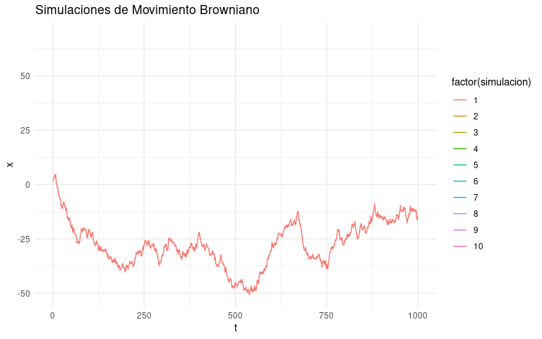
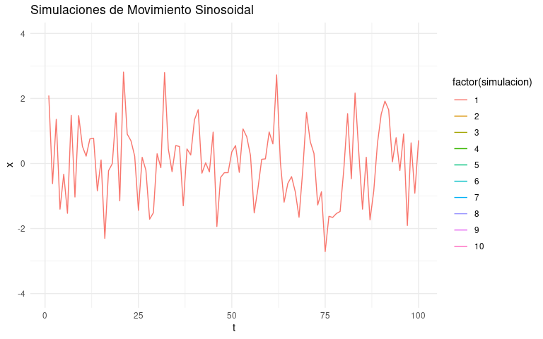

<div>


</div>

```{=html}
<script type="text/x-mathjax-config">
MathJax.Hub.Config({
  TeX: { equationNumbers: { autoNumber: "AMS" } }
});
</script>
```

```{r include=FALSE}
knitr::opts_chunk$set(
  warning = FALSE,
  echo = TRUE,
  message = FALSE
)

# Librerías
library(tidyverse)
library(janitor)
library(openxlsx)
library(flextable)
library(viridis)
library(scales)
library(DT)
library(lubridate)
library(gridExtra)
library(stats)
library(ggplot2)
library(gganimate)
source("funciones_personalizadas.R")
```

# 1. MOTIVACIÓN

Partiendo desde lo financiero, la economía, e incluyendo el área agrícola y social, las series de tiempo permiten abordar una gran cantidad de problemas y situaciones desde la ciencia de datos. Las series de tiempo son una de las herramientas más importantes para análisis de las dinámicas sociales, entre otras, y la existencia de nuevas paqueterías en lenguajes de programación como R han permitido el abordaje más comprensible de las mismas por parte de la comunidad académica e investigadores de todas las áreas.

Por ejemplo, series de datos de:

- Epidemiología: con datos sobre la propagación de una enfermedad.
- Medicina: la medición a lo largo del tiempo de la presión de la sangre, permite evaluar la implementación de medicamentos. (Shumway & Stoffer, 2017, 1)
Las imágenes por resonancia magnética funcional de patrones de series temporales de ondas cerebrales podrían usarse para estudiar cómo reacciona el cerebro a ciertos estímulos en diversas condiciones experimentales.(Shumway & Stoffer, 2017, 1)

Las series de tiempo son la apertura al mundo que andan los expertos en ciencias de datos, para hacer predicciones sobre tendencias económicas, pronósticos meteorológicos e incluso plataformas de contenido audiovisual. Las series de tiempo permiten las pistas para entender lo que ha sucedido en el pasado y lo que podría suceder en el futuro. La aplicación de series de tiempo, permite ver patrones, tendencias y comportamientos que no son tan visibles a simple vista.

Imagina que somos inversionistas tratando de decidir en qué acciones invertir. Conociendo cómo analizar series de tiempo, podemos estudiar el comportamiento histórico de esas acciones y hacer predicciones informadas sobre su desempeño futuro. O tal vez como científicos que quieren entender el cambio climático. Al analizar series de tiempo de temperaturas, niveles de CO2 y otros datos, podemos identificar patrones y evaluar el impacto de las acciones humanas en el medio ambiente.

Comprender sobre series de tiempo es obtener una llave para desbloquear el potencial de los datos en movimiento. Permite tomar decisiones más inteligentes en áreas que van desde las finanzas hasta la salud pública y la planificación urbana. Es una gran habilidad que nos convierte en mejores científicos de datos.

Así, revisemos que el análisis de un fenómeno social, financiero, económico, entre otros genera inquietudes sobre la medida o variable de interés en el fenómeno:

- ¿Está en crecimiento? 
- ¿Está cayendo?
- ¿Está repitiendo un fenómeno estacional?
- ¿Se está comportando aleatoriamente?
- ¿Está retornando a un valor estable que podemos pronosticar?
- ¿Cómo la dinámica del fenómeno se relaciona y reacciona a las dinámicas en otro fenómeno? 

Las respuestas a estas preguntas, hacen que consideremos nuestra data como parte de procesos dinámicos y nos lleva a utilizar técnicas como las que presentamos. (Box-Steffensmeier et al., 2014, 1)

# 2. LECTURA DE DATOS

Bajo este enfoque estimaremos el precio del aguacate usando sus propios precios pasados en lugar de usar la variable precio del dólar.

Primero leeemos el dataset de aguacate y hacemos ediciones para asegurar que las fechas se encuentren en formato ISO (yyyy-mm-dd)

```{r}
# Cargue y limpieza de datos.
# 🖇️ Se genera el vector de meses para usarlo más abajo con la función match.
meses <- c("Enero", "Febrero", "Marzo", "Abril", "Mayo",
           "Junio", "Julio", "Agosto", "Septiembre", "Octubre",
           "Noviembre", "Diciembre")

hass <- read.xlsx("datasets/Hass_Precios_Historicos.xlsx") %>% clean_names()
hass_dia <- hass %>%
  mutate(dia = sapply(strsplit(fecha, " "), "[", 3),
         mes = sapply(strsplit(fecha, " "), "[", 2),
         anio = sapply(strsplit(fecha, " "), "[", 5)) %>% 
  mutate(anio = as.double(anio)) %>% 
  # 🖇 Se utiliza la función match con el vector meses.
  mutate(mes = match(mes,meses)) %>%
  mutate(fecha = ymd(paste(anio, mes, dia, sep = "-")))

dolar <- read.csv2("datasets/Tasa_de_Cambio_Representativa_del__Mercado_-Historico.csv") %>% 
  clean_names()
```

Leemos el dataset de dolar, asegurando también fechas en formato ISO, y agregando por mes.

```{r}
# Vamos a sacar un valor promedio de cada variable por mes
# Para el dolar vamos a tomar el campo vigenciadesde
dolar <- dolar %>% 
  mutate(fecha =  format(as.Date(vigenciadesde, format = "%d/%m/%y"),
                         format = "%Y-%m-%d")) %>% 
  mutate(mes = month(fecha), anio = year(fecha)) %>% 
  mutate(valor = as.double(str_replace(valor,",",""))) %>%
  mutate(fecha= ymd(paste(anio, mes, 1, sep = "-"))) %>% 
  group_by(fecha) %>%
  summarise(precio_dolar = mean(valor), .groups = "drop")
print(dolar)
```

Construimos el dataset de aguacate agregado por mes

```{r}
hass_mes <- hass_dia %>% 
  mutate(fecha = ymd(paste0(anio,"-",mes,"-","01"))) %>%
  group_by(fecha) %>%
  summarise(precio_aguacate_kg = mean(precio_kg), .groups = "drop") 
```

Unimos los datasets agregados por mes

```{r}
hass_dolar <- dolar %>% 
  right_join(hass_mes, by = c("fecha"))
```

# 3. ALGUNOS CONCEPTOS GENERALES

[Variable aleatoria:]{style="color: red;"} Una variable aleatoria X es una función de \[f : \Omega \rightarrow \mathbb{R}\] con $\Omega$ el conjunto de resultados posibles de un experimento aleatorio. En otras palabras un mapeo desde el espacio de descripciones muestrales a los números reales con el fin de asociar a los resultados del experimento un valor numérico con el cual habilitar operaciones matemáticas. 

[Proceso estocástico:]{style="color: red;"} Sea $\mathcal{T}$ un conjunto arbitrario. Un proceso estocástico es una familia $\{X(t), \text{ t} \in \tau \}$, tal que, para cada $t \in \mathcal{T}, X(t)$ es una variable aleatoria.  Es decir, es una secuencia de variables aleatorias ordenadas por un índice, típicamente tomado del conjunto de los números enteros, o del conjunto de los números reales.

[Proceso estocástico en tiempo discreto:]{style="color: red;"} Es un proceso estocástico con un índice temporal discreto. Significando que $\tau \in \mathbb{Z}$


[Especificación de un proceso estocástico:]{style="color: red;"} Sea $t_1, t_2, t_3,...,t_n$ elementos cualquiera de $\mathcal{T}$ y consideremos

$$\begin{equation} \label{eq:ec1} F(x_1, x_2, x_3, ..., x_n; t_1, t_2, t_3, ..., t_n)=P\{X(t_1)<=x_1, ..., X(t_n)<=x_n\}\end{equation}$$
Entonces un proceso estocástico $\{X(t),t∈\mathcal{T}\}$ estará especificado si conocemos las distribuciones finito-dimensionales en ($\ref{eq:ec1}$), para todo n>=1. Esto significa que para $n=1$ conocemos las distribuciones uni-dimensionales de la variable aleatoria $X(t_1), t_1 \in \mathcal{T}$, para n=2 conocemos las distribuciones bi-dimensionales de las variables aleatorias $(X(t_1),X(t_2)), t_1, t_2 \in \mathcal{T}$ y así sucesivamente. Las funciones de distribución ($\ref{eq:ec1}$) deben satisfacer las dos condiciones siguientes:

- (i) (Condición de simetría): Para cualquier permutación $j_1, j_2,...,j_n$ de índices $1,2,3,...,n$, tenemos:

$$\begin{equation} \label{eq:ec2}F(x_{j_1},x_{j_2}, ..., x_{j_n}; t_{j_1},t_{j_2}, ..., t_{j_n}) = F(x_1, x_2,..., x_n; t_1, t_2, ..., t_n)\end{equation}$$

- (ii) (Condición de compatibilidad): Para $m<n$, 

$$\begin{equation} \label{eq:ec3}F(x_1,..., x_m, \infty, ...,\infty ; t_1,...,t_m,...,t_n) = F(x_1,..., x_m; t_1,...,t_m)\end{equation}$$
El lado izquierdo de ($\ref{eq:ec2}$) debe ser entendido como:

$\lim_{x_{m+1}, ..., x_n \to \infty}F(x_1,...,x_m,...,x_n;t_1,...,t_n)$

Se puede demostrar que cualquier conjunto de funciones de distribución de la forma ($\ref{eq:ec1}$), satisfaciendo las condiciones ($\ref{eq:ec2}$) y ($\ref{eq:ec3}$) define un proceso estocástico X_{t} sobre $\mathcal{T}$. Este teorema es conocido como **teorema de extensión de Kolmogorov**.

[Definición de un proceso estocástico estrictamente estacionario:]{style="color: red;"} Un proceso estocástico $\{X(t), \text{ t} \in \mathcal{T} \}$ se dice estrictamente estacionario si todas las distribuciones finito dimensionales tal como se definen en la ecuación ($\ref{eq:ec1}$) permanecen siendo las mismas sobre traslaciones en el tiempo, es decir:

$$F(x_1, x_2, x_3, ..., x_n; t_1+\tau, t_2+\tau, t_3+\tau, ..., t_n+\tau)=F(x_1, x_2, x_3, ..., x_n; t_1, t_2, t_3, ..., t_n)$$
Algunas consecuencias de lo anterior son:

- $E\{X(t)\} = \mu(t) = \mu$
- $Var\{X(t)\} = \sigma²(t) = \sigma²$
- $\gamma(t_1, t_2) = \gamma(t_1-t_2, 0) = Cov\{X(t_1-t_2), X(0)\}$ o equivalentemente $\gamma{\tau} = Cov\{X(t), X(t+\tau)\} = Cov\{X(0), X(\tau)\}$ para t, $\tau \in \mathcal{T}$

[Definición de un proceso estocástico débilmente estacionario:]{style="color: red;"} Un proceso estocástico $\{X(t), \text{ t} \in \mathcal{T} \}$ se dice débilmente estacionario (o estacionario en segundo orden) si y sólo si:

- (i) $E\{X(t)\}=\mu(t)=\mu$, constante, para todo $t \in \mathcal{T}$
- (ii) $E\{X^2(t)\}<\infty$, para todo $t \in \mathcal{T}$
- (iii) $\gamma(t_1,t_2)=Cov\{X(t_1),X(t_2)\}$ es una función sólo de |t_1-t_2|

A partir de ahora en esta guía estaremos interesados sólo en procesos de este tipo, los cuales denominaremos simplemente como procesos estacionarios. 

[Definición de proceso estocástico gaussiano:]{style="color: red;"} Un proceso estocástico $\{X(t), \text{ t} \in \mathcal{T} \}$ se dice Gaussiano, si para cualquier conjunto $t_1,t_2,..., t_n$ de $\mathcal{T}$, las variables aleatorias $X(t_1), X(t_2),..,X(t_n)$ tienen una distribución normal n-variada. 

Como un proceso normal n-variado con varianzas finitas queda determinado por sus medias y su estructura de covarianzas, si el es estacionario de segundo orden entonces el será estrictamente estacionario.

En lo que sigue, usaremos la siguiente notación: si el parámetro $t$ fuera discreto, esto es $t \in \mathbb{Z} = \{0, \pm1, \pm2, ...\}$, el proceso será descrito como $\{X_t, t \in  \mathbb{Z}\}$, y en caso de que $t$ sea continuo, esto es $t \in \mathbb{R}$, el proceso será denotado por $\{X(t), t \in  \mathbb{R}\}$. La misma convención aplicamos para los momentos. Por ejemplo: una función de autocovarianza para proceso discreto será denotado como $\gamma_\tau$ y una función de autocovarianza para proceso continuo como $\gamma(\tau)$.

[Definición de un proceso ruido blanco discreto:]{style="color: red;"} Decimos que $\{\varepsilon_t, t \in  \mathbb{Z}\}$ es un ruido blanco discreto si las variables aleatorias $\varepsilon_t$ son no correlacionadas, esto es, $Cov\{\varepsilon_{t},\varepsilon_{s}\}=0, t \ne s$

Un proceso de este tipo será además estacionario si $E(\varepsilon_t)=\mu$ y $Var(\varepsilon_t)={\sigma^2}_{\varepsilon}$ para todo $t$. Se sigue entonces que la función de autocovarianza de $\varepsilon$ esta dada por:

$\gamma_t = Cov(\varepsilon_n, \varepsilon_{n+\tau})={\sigma^2}_{\varepsilon}$ si $\tau=0$, de lo contrario será 0. 


**Reflexiones en lenguaje informal**

- Un proceso estocástico quedará suficientemente definido si definimos la distribución de probabilidad n-dimensional conjunta para cada $n>=1$, es decir, tomando $n$ variables del proceso estocástico a la vez, sería necesario especificar la relación estadística de esas n variables a la vez para cada eleción de n. En nuestro contexto implica especificar cómo se espera que el precio de hoy se relacione con el precio de ayer, o cómo se espera que el precio de hoy se relacione con el de ayer y además con el de antier. Y así sucesivamente para cualquier grupo finito de $n$ precios que decida tomar a consideración.

- Un proceso estocástico estacionario se puede interpretar como aquel cuyas propiedades estadísticas permanencen constantes a lo largo del tiempo y sólo cambiaran en función del grupo de $n$ variables que decida obervar conjuntamente, pero no de la posición de esas n variables en el tiempo. Por ejemplo, suponiendo que n=1, esto implicaría que las propiedades estadísticas de cada variable tomada individualmente no se ven alteradas conforme el tiempo avance, en particular cada variable será estable en media y en varianza. Lo que significa que puedo reunir las observaciones individuales en cada momento del tiempo para estimar la media constante y la varianza de toda la secuencia, en la media en que en cada punto temporal estoy asumiendo que la observación que registré proviene de poblaciones estadísticas con la misma media y la misma varianza. Esto siempre se cumplirá? Por supuesto que no, es una suposición que imponemos a los datos para poder hacer inferencia con un único set de valores históricos observados. 

- Como la condición de estacionariedad estricta dificilmente se puede comprobar en la práctica, como alternativa relajamos un poco las condiciones para exigencia de estacionariedad, por ejemplo podemos exigir estacionariedad débil consistente en pedir sólo homogeneidad en media, en varianza y en covarianza de segundo orden a la serie de tiempo bajo estudio. 

- Si la serie observada no parece cumplir estacionariedad podemos tomar la serie de variaciones porcentuales o podemos tomar la serie diferenciada $d$ veces. Por diferenciada entendemos tomar la serie de incrementos de un tiempo a otro, esto es: $X(t)-X(t-1)$. Estas transformaciones suelen reestablecer la estacionariedad. 

# 4. DEFINICIÓN DE MODELOS ARIMA

## 4.1 Ecuación general del modelo

En este curso vamos a discutir únicamente los modelos de la familia **ARMA(p,q)**(Autoregressive Movil Average) y **ARIMA(p,d,q)**(Autoregressive Integrated Movil Average), los cuales tiene la siguiente estructura:

- ARMA(p,q):

$X_t - \mu = \phi_1(X_{t−1} - \mu) + \phi_2(X_{t−2} - \mu)+... + \phi_p(X_{t−p}-\mu) + \varepsilon_t - \theta_1\varepsilon_{t−1} - \theta_2\varepsilon_{t−2}-...-\theta_q\varepsilon_{t−q}$

Donde $\mu$ sería la media general del proceso es decir $\mu = E(X_t)$ y $\varepsilon_{t} \sim RB(0,{\sigma}_{\varepsilon})$.

Equivalentemente se podría proponer también la siguiente especificación:

$X_t = c_0 +\phi_1X_{t−1} + \phi_2X_{t−2} +... + \phi_pX_{t−p} + \varepsilon_t - \theta_1\varepsilon_{t−1} - \theta_2\varepsilon_{t−2} - ... - \theta_q\varepsilon_{t−q}$

Esta segunda formulación contendría intercepto $c_0$, pero tomando valor esperado a ambos lados es claro que:

$$E(X_t) = c_0 + \phi_1E(X_{t−1}) +  \phi_2E(X_{t−2}) + ...+\phi_pE(X_{t−p})$$

Luego:

$$\mu = c_0 + \phi_1\mu +  \phi_2\mu + ...+\phi_p\mu\\\mu=\frac{c_0}{1-\phi_1-\phi_2-...-\phi_p}$$

Es decir que si la ecuación se escribe centrada respecto a $\mu$ no requiere intercepto pero en caso contrario requiere un intercepto $c_0$ cumpliendo la ecuación anterior. 

- ARIMA(p,d,q):

El proceso ARIMA no es más que una generalización para el proceso ARMA la cual incluye un término de diferenciación:

$\Delta^d X_t \sim ARMA(p,q)$

Puede notar que de forma comprimida hemos escrito $\Delta X_t$ para hacer referencia a la operación $X_t-X_{t-1}$. Si sucede que después de aplicar una diferenciación a la serie procedemos a repetir de nuevo el proceso de diferenciación, escribimos en forma comprimida $\Delta^2 X_t$, para indicar que se aplica una nueva diferenciación sobre la serie ya diferenciada. Al número $d$ de veces que se haya diferenciado la serie lo llamamos el grado de integración $d$ de la serie.

Aunque existen otras especificaciones mejoradas de modelos basados en la idea de los modelos ARMA y ARIMA, es importante en un curso introductorio a series de tiempo concentrarnos en entender primero los modelos clásicos antes de pasar a propuestas más sofisticadas como los modelos ARMA-GARCH o ARIMA-GARCH.

En el modelo ARMA anterior es importante aclarar lo siguiente:

- Tenemos una variable ${X_t}$ la cual asumimos que se puede modelar usando su historia. En la historia de dicha variable podemos considerar tres componentes: 

1. Los valores propiamente dichos de la variable en un momento pasado: $X_{t−1}, ... X_{t−p}$

2. Los choques aleatorios que ocurrieron en momentos pasados: $\varepsilon_{t−1} + ... + \varepsilon_{t−q}$

3. El choque aleatorio para el momento actual $\varepsilon_t$

Los dos últimos elementos pretenden capturar las variaciones en la variable que no se pueden explicar por la estructura de dependencia temporal de la variable misma sino por causas externas que producen variaciones no sistemáticas en los valores de la variable.

- Para los errores asumimos como es usual la normalidad $\varepsilon\sim N(0,{\sigma_{\varepsilon}}^2)$, la independencia de los errores y la homocedasticidad

- El modelo estará bien especificado si una vez ajustado a los datos se nos confirman los supuestos anteriores sobre los residuales observados.

- El parámetro $p$ se debe determinar en forma conveniente e indica la cantidad de rezagos de la variable a incluir como variables predictoras.

- El parámetro $q$ se debe determinar en forma conveniente e indica la cantidad de errores anteriores a considerar como predictores del valor actual.

- $\sigma_\varepsilon$ será otro parámetro a estimar y hablará de la varianza a largo plazo de todo mi proceso. 

- $\mu$ será otro parámetro a estimar en caso de que especifique el proceso no centrado. 

- La especificación funcional del modelo ARMA que acabamos de dar no coincide con la que R usa, en R los coeficientes $\theta_1,\theta_2,\theta_q$ se consideran con signo "+" en la ecuación anterior, por consiguiente las estimaciones que R nos entrega para tales coeficientes siempre tendrán signo opuesto a nuestra convención actual.

## 4.2 Supuestos importantes

Adicional al supuesto de normalidad de los errores, independencia y homocedasticidad, conviene mencionar dos supuestos adicionales que se usan frecuentemente dentro de la formulación de modelos de series de tiempo.

El primero es el supuesto de estacionariedad, recapitulamos su definición informal:

**Estacionariedad**: Un proceso estocástico se considera estacionario en sentido débil si las propiedades estadísticas de segundo orden del proceso no cambian a lo largo del tiempo. Como consecuencia de esto dichos procesos poseen las siguientes características:

- Media constante: La media de las observaciones es constante para todos los puntos en el tiempo.
- Varianza constante: La varianza de las observaciones es constante a lo largo del tiempo.
- Autocorrelación constante: La correlación entre observaciones qque distan entre sí una determinada cantidad de tiempo, cambia con respecto a la distancia en tiempo pero no con respecto a los tiempos en si mismos. Es decir, es decir la covarianza entre $X(t_2), X(t_1)$ se espera igual a la de $X(t_{20}), X(t_{19})$. La covarianza entre $X(t_3),X(t_1)$ no es por regla general que la de $X(t_3),X(t_2)$ porque no corresponden a tiempos a igual distancia. 

En la literatura estadística se distinguen dos tipos de estacionariedad:

- Estacionariedad estricta: Todas las distribuciones conjuntas son idénticas.
- Estacionariedad débil: La que ya se mencionó, donde las estadísticas relevantes (media, varianza, autocorrelaciones) son constantes o estables, dependen de la distancia en tiempo entre las variables pero no de los tiempos específicos considerados.

En el caso del modelo ARMA existirán ciertas condiciones que garantizarán su estacionariedad débil. Para que ello se impondrań ciertas condiciones sobre los coeficientes $\phi_i$ del componente autorregresivo del modelo. Más adelante daremos detalles. 

Por el contrario el modelo ARIMA será siempre **NO** estacionario. Sin embargo, de acuerdo con la ecuación que define al proceso ARIMA, éste puede pensarse como un tipo de proceso que requiere $d$ diferenciaciones para transformarse en un proceso ARMA. Como ya dijimos, por diferenciación entendemos la operación consistente en restar el valor actual $X_t$ de la serie con su valor un periodo antes $X_{t-1}$. Esta operación se suele proponer en series de tiempo porque es una estrategia que suele ser útil para lograr estacionariedad. Por lo tanto, si queremos obtener un proceso ARIMA conveniente para pronóstico, será suficiente con que garanticemos que su proceso ARMA asociado ya es estacionario después de las diferenciaciones aplicadas. 

Finalmente conviene mencionar un segundo supuesto que se usa en series de tiempo: el supuesto de ergodicidad, a continuación una definición no formal:

**Ergodicidad:** La ergodicidad es un concepto más profundo que se refiere a la condición de un proceso estocástico en el que las propiedades del proceso pueden estimarse a partir de una sola realización (una sola trayectoria) del proceso. En otras palabras, si un proceso es ergódico, una muestra finita de datos se comportará de manera similar a la población completa de datos. Como consecuencia de esto se permite la extracción de información estadística significativa a partir de una sola trayectoria del proceso. La ergodicidad es especialmente relevante en el contexto de procesos estocásticos no estacionarios, donde las propiedades estadísticas pueden cambiar con el tiempo. Tenga en cuenta que estacionariedad no es sinónimo de ergodicidad, podemos tener procesos estacionarios que sin embargo no son ergódicos. 

Para entender mejor este punto, considera los siguientes ejemplos:

**Ejemplo 1**:

Un **proceso de Wiener** también conocido como **movimiento Browniano** o **caminata aleatoria** que es no estacionario y no ergódico (sus incrementos son estacionarios pero no lo es el proceso en sí mismo).

Llamaremos movimiento browniano estándar (o proceso de Weiner) a un proceso continuo $W=\{W(t), t>=0\}$ tal que:

- (a) W(0) = 0
- (b) Para cualesquiera instantes $0<=t_1<=t_2<=...<=t_k<=1$ las variables aleatorias $W(t_2) - W(t_1), W(t_3) - W(t_2),..., W(t_k) - W(t_{k-1})$,  son independiente. Es decir los saltos o incrementos que le ocurren al proceso desde un tiempo $t_{k-1}$ a otro posterior $t_k$ son independientes. 
- (c) Para cualesquiera $s,t$, y $\tau$ no negativos las variables aleatorias $W(t)-W(s)$ y $W(t+\tau)-W(s+\tau)$ tienen la misma distribución. 
- (d) Para todo t>0, $W(t) \sim N(0.t)$
- (e) Las trayectorias de W(t) son continuas con probabilidad 1

Simulemos e ilustremos esta situación. 

```{r}
if (!file.exists("brownian_motion.gif")){
  
# Función para simular una trayectoria del movimiento browniano
simular_mov_browniano<- function(n_steps) {
  dt <- 1
  t <- seq(1, n_steps * dt, by = dt)
  x <- cumsum(rnorm(n_steps))
  data.frame(t, x)
}

# Número de trayectorias a simular
n_simulations <- 10

# Número de pasos en cada trayectoria
n_steps <- 1000

# Simulamos las trayectorias del movimiento browniano
simulaciones_browniano <- lapply(1:n_simulations, 
                                 function(i) simular_mov_browniano(n_steps))

# Conformamos un dataframe con los resultados
df_sim_browniano = data.frame(
  t=numeric(),
  x=numeric(),
  simulacion=numeric()
)
for (i in 1:length(simulaciones_browniano)){
  df_inc_browniano <- data.frame(
    t=simulaciones_browniano[[i]]$t,
    x=simulaciones_browniano[[i]]$x,
    simulacion=rep(i,length(simulaciones_browniano[[i]]$x))
    )
  df_sim_browniano <- rbind(df_sim_browniano, df_inc_browniano)
}

# Creamos un gráfico animado para Browniano
p_b <- ggplot() +
  geom_line(aes(x = t, y = x,
                color = factor(simulacion)),
            data = df_sim_browniano) +
  labs(title = "Simulaciones de Movimiento Browniano") +
  theme_minimal() +
  transition_states(simulacion, transition_length = 2, state_length = 1)

#Guardamos el gif animado
anim_save("brownian_motion.gif", animate(p_b), renderer = gifski_renderer())
}
```

<figure>

<figcaption>Img 1: Proceso no estacionario y no ergódico</figcaption>
</figure>

Observe que el proceso explota en varianza, es decir su varianza crece conforme el tiempo pasa (no estacionariedad), y observe que las trayectorias son tan diversas de una corrida a otra que la información depositada en una trayectoria poco nos puede informar de lo que ocurrirá con las demás o con el proceso en general. 

Ahora analicemos el segundo ejemplo:

**Ejemplo 2:**

Una señal sinosoidal con ruido blanco aditivo que es estacionaria pero no ergódica (sus propiedades estadísticas se preservan en el tiempo pero una única trayectoria no ayuda a estimar con precisión sus propiedades de fase, amplitud y frecuencia)

El proceso queda definido así:

$W=\{W(t), t>=0\}$ tal que:

- (a) $W(t)=Asin(2\pi ft + \phi) + \varepsilon_{t}$ con $\varepsilon_{t} \sim N(0,1)$
- (b) $\varepsilon_{t_1}, \varepsilon_{t_2}$ iid para todo $t_1, t_2$

Simulemos e ilustremos la situación:

```{r}
if (!file.exists("sinusoidal_motion.gif")){
# Función para estimar una señal sinosoidal estacioaria:
simular_sinosoidal <- function(n_steps){
# Parámetros del proceso
A <- 1          # Amplitud de la señal sinusoidal
f <- 0.1        # Frecuencia de la señal sinusoidal
phi <- pi/4     # Fase de la señal sinusoidal
ruido <- rnorm(n_steps) # Error aditivo

# Generar el proceso
t <- seq(1, n_steps, length.out = n_steps)  # Valores de tiempo
x <- A * sin(2 * pi * f * t + phi) + ruido
data.frame(t,x)
}

# Simulamos las trayectorias del movimiento sinosoidal
simulaciones_sinosoidal <- lapply(1:10,function(i) simular_sinosoidal(100))

#Creamos un dataframe con los resultados
df_sim_sinosoidal = data.frame(
  t=numeric(),
  x=numeric(),
  simulacion=numeric()
)
for (i in 1:length(simulaciones_sinosoidal)){
  df_inc_sinosoidal <- data.frame(
    t=simulaciones_sinosoidal[[i]]$t,
    x=simulaciones_sinosoidal[[i]]$x,
    simulacion=rep(i,length(simulaciones_sinosoidal[[i]]$x))
    )
  df_sim_sinosoidal <- rbind(df_sim_sinosoidal, df_inc_sinosoidal)
}

# Generamos el gráfico con la animación
p_s <- ggplot() +
  geom_line(aes(x = t, y = x,
                color = factor(simulacion)),
            data = df_sim_sinosoidal) +
  labs(title = "Simulaciones de Movimiento Sinosoidal") +
  theme_minimal() +
  transition_states(simulacion, transition_length = 2, state_length = 1)

#Guardamos el gif animado
anim_save("sinusoidal_motion.gif", animate(p_s), renderer = gifski_renderer())
}
```

<figure>

<figcaption>Img 2: Proceso estacionario y no ergódico</figcaption>
</figure>

Note que las trayectorias pueden considerarsen estables en media y varianza(estacionariedad), pero una trayectoria en particular no ofrece información suficiente para estimar con precisión los parámetros de fase, amplitud y frecuencia del proceso como un todo. 

## 4.3 Estimación de la función de autocorrelacion(ACF)

Debido a que estaremos exigiendo estacionariedad débil a las series de tiempo bajo estudio, tiene sentido preguntarnos por un estimador para la estructura de autocovarianza de una serie de tiempo dada. En general usamos la siguiente expresión para procesos estocásticos en tiempo discreto:

$$\hat{\gamma_{j}}=c_j=\frac{1}{T}\sum_{t=1}^{T-j}[(X_t-\bar{X})(X_{t+j}-\bar{X})], j=0,1,...,T-1$$
Siendo $\bar{X} = \frac{1}{T}\sum_{t=1}^{T} X_t$ la media muestral, como las autocovarianzas verdaderas son funciones pares no tememos decir que $c_{-j}=c_j$. Y para estimar las autocorrelaciones $\rho_j$ usamos:

$$\hat{\rho_j}=r_j=\frac{c_j}{c_0}$$

Donde de nuevo podemos decir que: $r_{-j}=r_j$

Se puede apreciar que $r_j$ es una función que depende de $j$ (el rezago considerado), es decir que para cada posible valor pasado de la serie de tiempo alejado $j$ periodos de tiempo del valor actual, tendremos un valor de $r_j$. Al conjunto de todos los valores posibles de $r_j$ se le conoce como la función de autocorrelación estimada de la serie o ACF. Ésta nos habla de la manera como cada valor de mi variable a predecir se correlaciona con los valores anteriores, es decir, con sus propios rezagos.

A continuación un ejemplo de cómo estimar la ACF sobre los datos de aguacate (con periodicidad diaria) usando la función acf que ya viene implementada en R.

Esta es la serie de precios diarios:

```{r}
hass_dia %>% 
  mutate(n_registro = as.numeric(rownames(.))) %>% 
  ggplot(aes(x= fecha, y = precio_kg, group = 1))+
  geom_line()
```

Esta es la función que me estima la autocorrelación:

```{r}
acf_dia <- acf(hass_dia$precio_kg)
data.frame(
  lag = acf_dia$lag,
  acf = acf_dia$acf) %>% head(10) %>% ftable()

# Acá construimos las bandas de confianza que informarán si la autocorrelación
# es significativa.

T<-length(hass_dia$precio_kg)
cuantil <- qnorm(0.975, 0,1)
bc <- cuantil/sqrt(T)

paste0("Declare la autocorrelación como significativa si |r|>", round(bc,5))
```

El estudiante curioso puede verificar que esto es equivalente a usar nuestra definición anterior asi:

```{r}

# ACF usando la definición
mi_acf <- function(y, k){
  n <- length(y)
  f1 <- y[(1+k):n]-mean(y)
  f2 <- y[1:(n-k)] - mean(y)
  f3 <- sum((y-mean(y))^2)
  r_mod <- sum(f1*f2)/f3
  return(r_mod)
}
paste0("Esta es la autocorrelación a 1 lag calculada con mi fórmula: ",
       mi_acf(hass_dia$precio_kg,1), " y esta es la calculada con r: ",
       acf_dia$acf[2])
```
## 4.4 Estimación de la función de autocorrelacion parcial (PACF)

Box, Jenkins y Reisel(1994) proponen la utilización de otro instrumento para facilitar la correcta identificación de un modelo ARMA para una serie de tiempo observada que se basa en la denominada función de autocorrelación parcial. 

Esta función nos habla de la contribución que tiene el $k-ésimo$ rezago al valor actual de nuestra variable de interés. Dicho de otra manera, cómo se espera que se correlacione un valor k periodos antes con el valor actual, pero tomando previo control de los k-1 rezagos intermedios que también pueden estar afectando el valor actual. Para ello tiene sentido proponer el siguiente modelo de regresión:

$X_t = \phi_{k1}X_{t-1} + \phi_{k2}X_{t-2} + .... +\phi_{kk}X_{t-k} + \varepsilon_{t}$

Donde el coeficiente $\phi_{kj}$ sería entonces el $j-ésimo$ coeficiente de un modelo autorregresivo de orden k, mientras que el último coeficiente $\phi_{kk}$ estaría informando específicamente del efecto que el $k-ésimo$ rezago tiene sobre el valor actual, una vez hemos descontado explícitamente los efectos de los restantes $k-1$ rezagos intermedios.

Si contaramos con un procedimiento adecuado para estimar $\phi_{kk}$, entonces contaríamos con un estimado de la correlación parcial al rezago $k$. Procedamos:

**Para k=1**: Estimamos el modelo:

$X_t = \phi_{11}X_{t-1} + \varepsilon_{t}$

Podemos multiplicar la ecuación anterior por $X_{t-1}$ y tenemos:

$X_tX_{t-1} = \phi_{11}X_{t-1}X_{t-1} + X_{t-1}\varepsilon_{t}$

Tomando valores esperados en ambos lados de la ecuación tenemos:

$E(X_tX_{t-1}) = \phi_{11}E(X_{t-1}X_{t-1}) + E(X_{t-1}\varepsilon_{t})$

Acá podemos usar una serie de hechos.

- (i) Podemos asumir sin pérdida de generalidad que $E(X_t) = 0$, 
- (ii) Por definición $E(X_tX_{t-1})=Cov(X_t, X_{t-1})=\gamma_1$ cuando $\mu=0$.
- (iii) $E(X_{t-1}\varepsilon_{t})=0$ pues $\varepsilon_{t} \sim RB(0,{\sigma}_{\varepsilon})$ y se produce independiente del valor previo $X_{t-1}$ así que está incorrelado con valores pasados de $X(t)$. 

Por lo tanto: 

$\gamma_1= \phi_{11}\gamma_0$

Ahora dividiendo entre la varianza $\gamma_0$ del proceso tenemos:

$\rho_1= \phi_{11}$

Remplazando $\rho_1$ por su estimado $r_1$ discutido en la sección previa, tenemos que:

$\hat{\phi}_{11}=r_1$

**Para k=2**: Estimamos el modelo:

$X_t = \phi_{21}X_{t-1} + \phi_{22}X_{t-2} + \varepsilon_{t}$

Podemos multiplicar la ecuación anterior por $X_{t-1}$, y luego hacer lo mismo pero multiplicando por $X_{t-2}$ obteniendo el siguiente sistema de ecuaciones:

- $\rho_1 = \phi_{21} + \phi_{22}\rho_1$ cuando se multiplica por $X_{t-1}$
- $\rho_2 = \phi_{21}\rho_1 + \phi_{22}$ cuando se multiplica por $X_{t-2}$

Reemplazando los $\rho_j$ por sus estimados tenemos:

- $r_1 = \phi_{21} + \phi_{22}r_1$ cuando se multiplica por $X_{t-1}$
- $r_2 = \phi_{21}r_1 + \phi_{22}$ cuando se multiplica por $X_{t-2}$

El cual puede resolverse para $\phi_{22}$ como:

$$\hat{\phi}_{22} = \frac{
\begin{vmatrix}
  1 & r_1 \\
  r_1 & r_2
\end{vmatrix}}
{\begin{vmatrix}
  1 & r_1 \\
  r_1 & 1
\end{vmatrix}}
=\frac{r_2-r_1^2}{1-r_1^2}$$

**Para k=3**: Estimamos el modelo:

$X_t = \phi_{31}X_{t-1} + \phi_{32}X_{t-2} + \phi_{33}X_{t-3} + \varepsilon_{t}$

Podemos multiplicar la ecuación anterior por $X_{t-1}$,$X_{t-2}$, y $X_{t-3}$ para obtener el siguiente sistema de ecuaciones:

- $\rho_1 = \phi_{31} + \phi_{32}\rho_1 + \phi_{33}\rho_2$ cuando se multiplica por $X_{t-1}$
- $\rho_2 = \phi_{31}\rho_1 + \phi_{32} + \phi_{33}\rho_1$ cuando se multiplica por $X_{t-2}$
- $\rho_3 = \phi_{31}\rho_2 + \phi_{32}\rho_1 + \phi_{33}$ cuando se multiplica por $X_{t-3}$

El cual, después de los reemplazos de las estimaciones de los $\rho_i$ por sus respectivos $r_i$ puede resolverse para $\phi_{33}$ como:

$$\hat{\phi}_{33} = \frac{
\begin{vmatrix}
  1 & r_1 & r_1\\
  r_1 & 1 & r_2\\
  r_2 & r_1 & r_3
\end{vmatrix}}
{\begin{vmatrix}
  1 & r_1 & r_2\\
  r_1 & 1 & r_1\\
  r_2 & r_1 & 1\\
\end{vmatrix}}$$

Y en general, podemos deducir que para estimar $\phi_{kk}$ construimos un modelo de regresión con los k rezagos, y lo multiplicamos convenientemente por cada uno de ellos para obtener que:

$$\hat{\phi}_{kk} = \frac{|P^*_k|}{|P_k|}$$

Donde la matriz $|P_k|$ es una matriz de autocorrelaciones muestrales $r_i$, mientras que la matriz $|P^*_k|$ es la misma matriz $|P_k|$ con su última columna reemplazada por el vector de autocorrelaciones muestrales $r_i$. A las cantidades $\hat{\phi}_{kk}$ tabuladas en función del valor $k$ elegido, se le conoce como función de autocorrelación parcial estimada. Y las ecuaciones previamente construidas como las ecuaciones de Yule-Walker. 

Veamos como extraer tales estimados usando sobre la serie de precios de aguacate con periodicidad diaria R

```{r}
pacf_dia <- pacf(hass_dia$precio_kg)
data.frame(
  lag = pacf_dia$lag,
  pacf = pacf_dia$acf) %>% head(10) %>% ftable()

# Realicemos una comprobación usando funciones

matriz_autocorrelacion <- function(x, k){
  acf <- acf(x, plot=FALSE)$acf[2:(k+1)]
  if (k==1){
    return(acf[1])
  }else{
  acf_mod <- c(c(1),acf[1:(length(acf)-1)])
  matriz_acf <- matrix(data = rep(0, k*k),
                       nrow = k,
                       ncol = k,
                       byrow = TRUE)
  for (i in (1:k)){
    for (j in (1:k)){
      d <- abs(i-j)
      r <- acf_mod[d+1]
      matriz_acf[i,j] <- r 
    }
  }
  matriz_num <- matriz_acf
  for (p in 1:k){
    matriz_num[p,k] <- acf[p]
  }
  return(det(matriz_num)/det(matriz_acf))
  }
}

phi_33 <-matriz_autocorrelacion(hass_dia$precio_kg, 3)

paste0("Esta es la autocorrelación parcial a 1 lag calculada con mi fórmula: ",
       phi_33, " y esta es la calculada con r: ",pacf_dia$acf[3])
```

[Nota importante:]{style="color: red;"} 

En los apartados anteriores hemos calculado las funciones acf y pacf sobre la serie de precios diarios del aguacate. Debido a que acf decae muy lentamente, es indicativo de la presencia de una raíz unitaria en el polinomio autorregresivo que puede estar generando problemas de no estacionariedad. En estos casos será recomendable diferenciar la serie antes de proceder al modelamiento. En particular se sugiere primero intentar con una transformación del tipo:

$$ \Delta precio_t = precio_t - precio_{t-1}$$
Y en lugar de modelar la serie $precios_t$, modelamos la serie $\Delta precio_t$. Otra elección ampliamente usada en la práctica es crear una serie como esta:

$$r_t = \Delta precio_t / precio_{t-1} = \frac{precio_t - precio_{t-1}}{precio_{t-1}}$$
La cual representa una serie de precios diferenciada pero luego expresada como variaciones porcentuales (retornos) del precio actual respecto al del día anterior. 

Cualquiera de las dos transformaciones suelen remover la integración y permiten tratar con una serie inicial estacionaria. Si pese a esta primera transformación sigue sin lograrse estacionariedad será necesaria una nueva diferenciación de la serie obtenida.

Vamos a estacionarizar la serie contemplando los cambios porcentuales

```{r}

df_variaciones <- data.frame(
  variaciones  = (hass_dia$precio_kg - lag(hass_dia$precio_kg)) / lag(hass_dia$precio_kg))

df_variaciones <- df_variaciones %>% 
  filter(!is.na(variaciones))

ggplot(data= df_variaciones, aes(x= seq(1,length(variaciones)),
                                 y = variaciones, group = 1))+
  geom_line()

```
Este gráfico ya parece más estable en media y por lo tanto es un mejor candidato para ser estimado usando modelos ARMA. 

[Prueba de raíces unitarias:🆕 🔍]{style="color: red;"} 

Una prueba de raíces (también conocida como prueba de raíz unitaria) es una prueba estadística que se utiliza en el análisis de series de tiempo para determinar si una variable tiene raíces unitarias. Las raíces unitarias indican que una serie de tiempo no es estacionaria y, por lo tanto, no es adecuada para el modelado de series de tiempo.

Una variable con raíces unitarias es aquella cuyo proceso estocástico subyacente no ha convergido a una media o varianza constante a lo largo del tiempo. En otras palabras, la serie de tiempo muestra patrones de comportamiento no estacionario.

Las pruebas de raíces unitarias comunes incluyen:

- Prueba de Dickey-Fuller Aumentada (ADF): Esta es una de las pruebas más utilizadas. Evalúa si existe una raíz unitaria en una serie de tiempo univariada. La hipótesis nula en esta prueba es que la serie de tiempo tiene una raíz unitaria, lo que significa que no es estacionaria.

- Prueba de Dickey-Fuller Aumentada con lags (ADF-GLS): Similar a la ADF, pero con corrección de errores lagged.

- Prueba de Phillips-Perron: Otra prueba común para la raíz unitaria, que es similar a la ADF.

- Prueba de Kwiatkowski-Phillips-Schmidt-Shin (KPSS): A diferencia de las pruebas anteriores, la KPSS se utiliza para determinar si una serie de tiempo es estacionaria en tendencia en lugar de estacionaria alrededor de una media constante.

La elección de la prueba adecuada depende de la naturaleza de los datos y el objetivo del análisis. Si una variable tiene raíces unitarias, generalmente es necesario realizar transformaciones, como diferenciación, para hacer que la serie de tiempo sea estacionaria antes de aplicar técnicas de modelado de series de tiempo, como modelos ARIMA (Media Móvil Autorregresiva Integrada) o modelos GARCH (Generalized Autoregressive Conditional Heteroskedasticity).

En resumen, una prueba de raíces es una herramienta importante en el análisis de series de tiempo para determinar la estacionariedad de una variable y la necesidad de realizar transformaciones antes de modelar los datos.

[Prueba de Dickey Fuller:🆕 🔍]{style="color: red;"} 

La prueba Dickey-Fuller se usa para detectar estadísticamente la presencia de conducta tendencial estocástica en las series temporales de las variables mediante un contraste de hipótesis.

Interpretación del rechazo, o no rechazo de la Hipótesis Nula de la prueba.
El contraste será el siguiente:

- $H_0=0$ → Existe raíz unitaria, xt $\rightarrow$ La serie no es estacionaria.
- $H_0\ne0$ → No existe raíz unitaria,xt  $\rightarrow$ La serie es estacionaria.

Si:
- $τ−calculado$ en valor absoluto > $τ−crítico$, en valor absoluto: Se rechaza la $H_0$
- $τ−calculado$ en valor absoluto < $τ−crítico$, en valor absoluto: Se acepta la $H_0$

*Vamos a aplicar la prueba para los precios del aguacate mensuales y sin ninguna transformación.*

```{r}
library(urca)
# Vamos a guardar el resultado en un elemento llamado df que hace referencia a la prueba
# Dickey Fuller
df <- ur.df(hass_mes$precio_aguacate_kg, type = "none", lags = 0)
summary(df)
```

De acuerdo con lo anterior, la serie **no es estacionaria**, porque el valor p es 0.7898, por lo tanto no tenemos evidencia suficiente para rechazar la hipotesis nula, es decir que no hay evidencia para confiar en la estacionariedad.

*Ahora vamos a aplicar la prueba para las* **variaciones** *de precios del aguacate*

```{r}
# Vamos a guardar el resultado de nuevo en df que hace referencia a la prueba
# Dickey Fuller
df <- ur.df(df_variaciones$variaciones, type = "none", lags = 0)
summary(df)
```

🏁 👍 Ahora si encontramos que la variable se ha transformado en una variable estacionaria, puesto que el p valor es menor a 0.05 por lo tanto, tenemos evidencia estadística suficiente para rechazar la hipótesis nula, reiterando entonces que NO EXISTE RAÍZ UNITARIA y que la variable es estacionaria.

⚠️** Important:e**

Acá estamos partiendo del supuesto de que la serie tiene tendencia estocástica, pero si este supuesto falla y la serie en realidad tiene tendencia deterministica, las conclusiones de la prueba DICKEY FULLER pueden ser engañosas.

Porque tendríamos que entrar a analizar:

- ¿Cuál es la diferencia entre tendencia estocástica y tendencia deterministica?

Veamoslo con un ejemplo sacado de la Wikipedia:

<figure>

<figcaption>Img 3: Ejemplo de estacionaria en tendencia vs raiz unitaria </figcaption>
</figure>

El diagrama anterior representa un ejemplo de una potencial raíz unitaria. La línea roja representa una caída observada en la producción, la verde muestra el camino de la recuperación si la serie tiene una raíz unitaria. Azul muestra la recuperación si no hay raíz unitaria y la serie es estacionaria tendencia. La línea azul vuelve a cumplir y seguir la línea de tendencia de puntos, mientras que la línea verde se mantiene permanentemente por debajo de la tendencia. La  hipótesis de raíz unitaria también sostiene que un aumento en la producción dará lugar a niveles de producción superiores a la tendencia del pasado.

```{r}
acf_variaciones <- acf(df_variaciones$variaciones)
acf_variaciones$acf
T<-length(df_variaciones$variaciones)
cuantil <- qnorm(0.975, 0,1)
bc <- cuantil/sqrt(T)
paste0("Declare la autocorrelación como significativa si |r|>", round(bc,5))
```

Hemos agotado el análisis del ACF, ahora pasemos al anális del PACF:

```{r}
pacf_variaciones <-  pacf(df_variaciones$variaciones)
```

Acá notamos que el diagrama PACF parece dominado por una mixtura de decaimientos exponenciales y sinusoidales amortiguadas (no exactamente, pero en forma aproximada)

**Conclusión**:

Tenemos un ACF que se corta después del rezago 2 y un PACF con comportamiento sinosuoidal que pueden ser asociados a un modelo de tipo MA(2) según se muestra en la tabla de identificación de modelos del capítulo 5. 

## 4.5 Caso 1: Modelo Autorregresivo AR(p) puro

Es importante estudiar casos particulares del modelo ARIMA. Por ejemplo, si suponemos que d=q=0, estamos ante el caso de un modelo autorregresivo puro. 

Decimos que $\left\{X_t,t \in \mathbb{Z}\right\}$ es un proceso autoregresivo de orden $p$, y escribimos $X_t \sim\ AR(p)$, si satisface la ecuación de diferencias.

\begin{equation}X_t - \mu = \phi_1 (X_{t-1} - \mu) + \phi_2(X_{t-2}-\mu)+ ... + \phi_p(X_{t-p}-\mu)+ \varepsilon_t\label{eq:2.24}\end{equation}


Donde $\mu,\phi_1,...\phi_p$ son parámetros reales y $\varepsilon \sim\ RB(0,\sigma^{2})$ que quiere decir que el proceso autoregresivo tiene como condición que el error sea Ruido Blanco. Nótese que $E(X_t)= \mu$ y si escribimos el proceso en la forma:

$$X_t = \phi_0 + \phi_1 X_{t-1} + ... \phi_p X_{t-p} + \varepsilon_t$$

Entonces:

$$\mu = E(X_t) = \frac{\phi_0}{1-\phi_{1} - ... - \phi_p}$$

Definamos el operador retroactivo B a través de $B^{s}X_t = X_{t-s},s \geq 1$. Entonces (\ref{eq:2.24}) puede ser escrita.

\begin{equation}\phi(B)\tilde{X}_t = \varepsilon_t\label{eq:2.25}\end{equation}

Donde $\phi(B) = 1 - \phi_1B - \phi_2B^2 - ... -\phi_pB^{p}$ es el operador autoregresivo de orden $p$ y $\tilde{X}_t = X_t - \mu$. Suponga $\mu = 0$ en adelante. 


[Proceso AR(1):]{style="color: red;"} Un caso particular importante es el proceso AR(1).

\begin{equation}X_t = \phi X_{t-1} + \varepsilon_t\label{eq:2.26}\end{equation}.

Como $\phi(B) = 1 - \phi B$. A través de sustituciones sucesivas obtenemos.

$$X_t = \sum\limits_{j=0}^{r} \phi^j \varepsilon_{t-j} + \phi^{r+1}X_{t-r-1}$$

Si $X_t$ fuera estacionario, con varianza finita $\sigma^2 X$, entonces.

$$E[X_t - \sum\limits_{j=0}^{r}\phi^j \varepsilon_{t-j}]^2 = \phi^{2r+2}E[X_{t-r-1}^2] = \phi^{2r+2}{\sigma^2}_X$$

Si $|\phi| < 1$, $\phi^{2(r+1)} \rightarrow 0$, cuando $r \rightarrow \infty$, por lo tanto sobre esta suposición, podemos escribir.

\begin{equation}X_t = \sum\limits_{j=0}^{\infty}\phi^j \varepsilon_{t-j}\label{eq:2.27}\end{equation}

Donde la convergencia es en media cuadrática. Luego, la condición $|\phi|<1$ es suficiente para que $X_t$ sea estacionario. Multiplicando ambos miembros de (\ref{eq:2.26}) por $X_{t-\tau}$ y tomando la esperanza, obtenemos.

$$\gamma_{\tau} = \phi \gamma_{\tau-1} = ... = \phi^{\tau}\gamma_0$$
Además de (\ref{eq:2.27}), obtenemos:


\begin{equation}\gamma_0 = {\sigma^2}_X = \sigma^2 \sum\limits_{j=0}^{\infty}\phi^{2j} = \frac{\sigma^2}{1-\sigma^2}\label{eq:2.28}\end{equation}

De lo que se sigue:

$$\gamma_{r} = \frac{\sigma^2}{1-\phi^2}\phi^{\tau}, \tau \geq 0$$

Como $\gamma_\tau$ es simétrica, podemos escribir finalmente la f.a.c.v (función de autocovarianza) de un proceso AR(1) como:

\begin{equation}\gamma_\tau = \frac{\sigma^2}{1 - \phi^2} \phi^{\lvert \tau \rvert}, \quad \tau \in\mathbb{Z}\label{eq:2.29}\end{equation}

La f.a.c de $X_t$ es obtenida de (\ref{eq:2.29}), es decir,


\begin{equation}\rho_\tau = \frac{\gamma_\tau}{\gamma_0} = \phi^{\lvert \tau \rvert}, \quad \tau \in \mathbb{Z}\label{eq:2.30}\end{equation}

A continuación dibujamos dos ejemplos de procesos AR(1), junto con sus respectivas funciones de autocorrelación 

<figure>

<figcaption>Img 4: Ejemplos de ACF para procesos AR(1) a) $\phi=0.8$ b) $\phi=-0.8$</figcaption>
</figure>

[Proceso AR(p):]{style="color: red;"}

Ahora analicemos la solución para el proceso en (\ref{eq:2.24}) en la forma (\ref{eq:2.27}), esto es:

\begin{equation}X_t = \sum^{\infty}_{j=0}\psi_j\varepsilon_{t−j}\label{eq:2.31}\end{equation}

De (\ref{eq:2.25}) tenemos formalmente que:

$$X_t = \phi(B)^{-1}\varepsilon_t=\psi(B)\varepsilon_t$$
Donde $\psi(B) = 1+\psi_1B+\psi_2B^2+. . ..$ en analogía al caso AR(1), debemos tener que $\sum_{j}{\psi_j}^2<\infty$ para que desde luego (\ref{eq:2.31}) sea una solución estacionaria. 

Como $\phi(B)\psi(B) = 1$, los coeficientes $\psi_j$'s pueden ser obtenidos de esta identidad en función de los $φ_j$’s. Se puede demostrar que una condición para que $X_t$ sea estacionario es que todas las raices de $\phi(B)=0$ estén por fuera del círculo unitario. En particular para $p=1$, $\phi(B)=1-\phi B=0$ implica que $B=\phi^{-1}$, lo que conllevó a que se exigiera que $|\phi|<1$. 

Suponiendo un proceso estacionario, multiplicando a ambos miembros de (\ref{eq:2.24}) por $X_{t-\tau}$, y tomando valores esperados, obtenemos, para $\tau>=0$,

\begin{equation}{\sigma^2}_{x} = \frac{\sigma^2}{1-\phi_1\rho_1-\phi_2\rho_2-...-\phi_p\rho_p}\text{ para $\tau=0$,}\label{eq:2.32}\end{equation}

\begin{equation}\gamma_{\tau} = \phi_1\gamma_{\tau-1}+\phi_2\gamma_{\tau-2}+...+\phi_p\gamma_{\tau-p}\text{ para $\tau>0$,}\label{eq:2.33}\end{equation}

Una misma ecuación es satisfecha por los $\rho_{\tau}$, bastando con dividir todos los términos por $\gamma_0$. Una solución general de la ecuación fue dada por (Miller, 1969):

\begin{equation}\gamma_{\tau} = A_1{G_1}^{\tau}+A_2{G_2}^{\tau}+...+A_p{G_p}^{\tau}\label{eq:2.34}\end{equation}

Donde los ${G_i}$ satisfacen:

$\phi(B)=\prod_{i=1}^{p}(1-G_iB)$

Y como las raices de $\phi(B)=0$ deben estar fuera del círculo unitario, debemos tener que $|G_i|<1$, para todo $i=1,2,..,p$

Ahora bien si fijamos $\tau=1,2,..,p$ en (\ref{eq:2.33}), obtenemos:

\begin{equation}\Gamma_p\vec{\phi}_p=\gamma_p\label{eq:2.35}\end{equation}

Donde $\Gamma_p = [\gamma_{ij}]$ con $\gamma_{ij}=\gamma_{|i-j|}$, $i,j=1,2,...,p$,
$\vec{\phi}_p = (\phi_1,\phi_2,...,\phi_p)$.

Las ecuaciones (\ref{eq:2.35}) pueden ser utilizadas para obtener estimadores de los parámetros $\phi_j$'s, sustituyendo la función de autocovarianzas por sus estimados. Estos estimadores son llamados estimadores de **Yule-Walker**.

Un análisis de  (\ref{eq:2.34}) nos permite concluir que la función de autocovarianza y de autocorrelación de un proceso autorregresivo de orden $p$ es una mixtura de exponenciales (correspondientes a las raices $G_i$ que sean reales) y/o senosoidales amortiguadas (correspondientes a los pares de raices complejas conjugadas).

En la siguiente figura tenemos las funciones de autocorrelación para dos procesos AR(2), uno con $\phi=0.5, \phi_2=0.3$ y otro con $\phi_1=1,\phi_2=-0.89$.De donde se deduce que:

**Proceso 1**:

$\phi(B)=1-0.5B-0.3B^2$ de modo que necesitamos raices para: $0.3B^2+0.5B-1=0$

Así que:

$B_1 = -2.84027...$ y $B_2=1.1736$

Luego las raices son reales, y caen fuera del círculo unitario (tienen magnitud mayor a 1). Lo que indica que el proceso será estacionario y la función de autocorrelación estará dominada por un decaimiento exponencial.

**Proceso 2**:

$\phi(B)=1-B+0.89B^2$ de modo que necesitamos raices para: $0.89B^2-B+1=0$

Así que:

$B_1 = 0.561798 - 0.898876 i$ y $B_2 = 0.561798 + 0.898876i$

Luego las raices son complejas conjugadas, y de nuevo caen fuera del círculo unitario pues $0.5617978^2+0.898876^2>1$, así que el proceso también es estacionario y la función de autocorrelación estará dominada por funciones senosoidales amortiguadas.

<figure>

<figcaption>Img 5: Ejemplos de ACF para procesos AR(2) a) $\phi=0.5, \phi_2=0.3$ b) $\phi_1=1,\phi_2=-0.89$</figcaption>
</figure>

## 4.6 Caso 2: Proceso de medias móviles MA(q) puro

Decimos que $\{X_t, t \in \mathbb{Z}\}$ es un proceso de medias móviles de orden $q$, denotado como $MA(q)$, si satisface la ecuación de diferencias.

\begin{equation}X_t = \mu + \varepsilon_t - \theta_1 \varepsilon_{t-1} - \ldots - \theta_q \varepsilon_{t-q},\label{eq:2.36}\end{equation}

Donde $\mu,\theta_1, ..., \theta_q$ son constantes reales y $\varepsilon_t \sim\ RB(0,\sigma^2)$.

Nótese que $X_t$ es estacionario, con media $\mu$, y como $\varepsilon_t$ son no correlacionados, podemos obtener fácilmente la varianza del proceso.

\begin{equation} \sigma^2_X = \sigma^2 \left(1 + \theta^2_1 + \ldots + \theta^2_q\right)\label{eq:2.37}\end{equation}

Suponga $\mu=0$. En cuanto a la función de autocovarianza, tenemos.


$$\gamma_\tau = E\{X_t X_{t-\tau}\} = \gamma_\varepsilon(\tau) - \sum_{k=1}^q \theta_k \gamma_\varepsilon(k - \tau)$$

$$-\sum_{k=1}^q \theta_{\mathcal{l}} \gamma_\varepsilon(\tau + l) + \sum_{k=1}^q \sum_{l=1}^q \theta_k \theta_{l} \gamma_\varepsilon(\tau + l - k)$$

Donde estamos denotando por $\gamma_{\varepsilon}(\tau)$ una f.a.c.v (función de autocovarianza) de $\varepsilon_t$. Resulta entonces,

\begin{equation} \gamma_\tau = \begin{cases} \sigma^2 (-\theta_\tau + \theta_1 \theta_{\tau+1} + \ldots + \theta_q \theta_{q-\tau}), & \text{si } \tau = 1, \ldots, q \\ 0, & \text{si } \tau > q \\\gamma_{-\tau}, & \text{si } \tau < 0\end{cases}\label{eq:2.38}\end{equation}

De (\ref{eq:2.37}) y (\ref{eq:2.38}) obtenemos una f.a.c (función de autocorrelación) del proceso $MA(q)$

\begin{equation}\rho_\tau = \begin{cases}\frac{-\theta_\tau + \theta_1 \theta_{\tau+1} + \ldots + \theta_q \theta_{q-\tau}}{1 + \theta_1^2 + \ldots + \theta_q^2}, & \text{si } \tau = 1, \ldots, q \\0, & \text{si } \tau > q \\\rho_{-\tau}, & \text{si }\tau < 0\end{cases}\label{eq:2.39}\end{equation}

Observamos, entonces, que la f.a.c.v (o f.a.c) de un proceso $MA(q)$ se anula para $|\tau| > q$. En particular, para un proceso $MA(1)$,

\begin{equation}X_t = \varepsilon_t - \theta \varepsilon_{t-1}\label{eq:2.40}\end{equation}

Obtenemos

$$\text{Var}(X_t) = \sigma^2_X = \sigma^2 (1 + \theta^2)$$,

\begin{equation}\rho_\tau =\begin{cases}\frac{-\theta}{1 + \theta^2}, & \text{si } \tau = \pm 1 \\0, & \text{si } \lvert \tau\rvert > 1\end{cases}\label{eq:2.41}\end{equation}

Definiendose el operador de medias móviles de orden $q$ por:

$\theta(B) = 1 - \theta_1B - \theta_2B^2 - \ldots - \theta_qB^q$

El proceso (\ref{eq:2.36}) puede ser escrito

\begin{equation}X_t = \theta(B)\varepsilon_t\label{eq:2.42}\end{equation}

En particular, para el proceso $MA(1)$ tenemos $\theta(B)=1-\theta B$, de modo que podemos escribir.

$X_t = (1 - \theta B)\varepsilon_t$

De donde formalmente se sigue:

$\varepsilon_t = (1 - \theta B)^{-1}X_t = (1 + \theta B + \theta^2 B^2 + \ldots)X_t$,

Por lo que tenemos:

\begin{equation}X_t = -\theta X_{t-1} - \theta^2 X_{t-2} - \ldots + \varepsilon_t\label{eq:2.43}\end{equation}

Si $|\theta| < 1$, la serie del lado derecho de (\ref{eq:2.43}) converge. En esta ecuación, expresamos $X_t$ como un proceso autoregresivo de orden infinito. Decimos que $|\theta| < 1$ es una condición de invertibilidad para el proceso MA(1). En general, el proceso (\ref{eq:2.36}) puede escribirse de la siguiente manera:

\begin{equation} X_t = \sum\limits_{j=1}^{\infty}\pi_j X_{t-j} + \varepsilon_t \label{eq:2.44}\end{equation}

Si se satisface la siguiente condición de invertibilidad: todas las raíces de $\theta(B) = 0$ deben estar fuera del círculo unitario. Ver Box, Jenkins y Reinsel (1994) para obtener más detalles.

La relación (\ref{eq:2.44}) puede ser escrita:

\begin{equation}\pi (B)X_t = \varepsilon_t\label{eq:2.45}\end{equation},

donde $\pi(B) = 1 - \pi_1B - \pi_2B^2 - \ldots$, de modo que $\pi(B) = \theta(B)^{-1}$. Por lo tanto, los coeficientes $\pi_j$ pueden obtenerse a partir de la identidad $\theta(B)\pi(B) = 1$.

[Nota importante sobre invertibilidad:]{style="color: red;"}

La condición de invertibilidad es fundamental en el contexto de un proceso de media móvil (MA) por varias razones importantes:

- Existencia de una representación causal: Un proceso MA invertible tiene una representación causal, lo que significa que los valores pasados (anteriores en el tiempo) del proceso pueden utilizarse para predecir valores futuros. Esta característica es esencial en aplicaciones donde se necesita prever o modelar valores futuros del proceso.

- Estimación de parámetros: Para estimar los parámetros de un modelo MA utilizando técnicas de ajuste, como el método de máxima verosimilitud, es fundamental que el proceso sea invertible. Un proceso no invertible puede llevar a estimaciones incorrectas de los parámetros del modelo, lo que afectaría la calidad de las predicciones.

- Estabilidad del proceso: La invertibilidad está relacionada con la estabilidad del proceso. En un proceso invertible, las características estadísticas del proceso tienden a ser más estables y predecibles en comparación con un proceso no invertible, que puede ser más impredecible y menos estable.

- Validación del modelo: La invertibilidad es un criterio importante para validar la adecuación de un modelo MA. Un proceso no invertible puede ser una señal de que el modelo no es adecuado para representar la serie de tiempo, lo que podría requerir una revisión y ajuste del modelo.

- Interpretación de los parámetros: En un proceso invertible, los coeficientes del modelo MA tienen una interpretación más clara. Por ejemplo, en un modelo MA(1) invertible, el coeficiente del rezago 1 ($\theta_1$) representa la influencia inmediata de los errores pasados en el valor actual, lo que facilita la interpretación y el análisis del proceso.

En resumen, la condición de invertibilidad es esencial para garantizar que un modelo MA sea adecuado y útil para el análisis y la predicción de una serie de tiempo. Sin esta condición, la interpretación de los parámetros y la capacidad del modelo para predecir valores futuros pueden verse comprometidas, lo que subraya la importancia de verificar y asegurar que un proceso MA sea invertible.

Consideremos entonces el siguiente ejemplo:

\begin{equation} X_t = \varepsilon_t - 0.8 \varepsilon_{t-1}, \varepsilon_t \sim \text{i.i.d. }\mathcal{N}(0,1)\label{eq:2.46}\end{equation}

Donde tenemos un proceso MA(1) con $\theta_1 = 0.8$. Para este proceso reemplazando en (\ref{eq:2.41}) tenemos que $\rho_1 = \frac{-0.8}{(1+0.8^2)}=-0.49$, mientras que $\rho_{\tau}=0$, $\tau>=2$, y $\rho_{-\tau}=\rho_{\tau}$, por lo tanto tenemos un gráfico para el proceso $X_t$ y su función de autocorrelación como el que se muestra a continuación:

<figure>

<figcaption>Img 6: Proceso MA(1) simulado, $\theta_1=0.8$ y su f.a.c.</figcaption>
</figure>

En la gráfica puede apreciar como las autocorrelaciones estimadas con base en la única trayectoria simulada tienden a ser despreciables después del lag 1, no logrando ser 0 completamente seguramente debido a que se trata de una muestra y no del proceso teórico como un todo. 

Las bandas de confianza dibujadas en la f.a.c indican que en el 95% de los casos, trayectorias simuladas bajo el modelo teórico tendrán autocorrelaciones que caen dentro de las bandas, o lo que es lo mismo, que si el proceso subyacente es realmente el proceso teórico, sólo en el 5% de los casos observaremos autocorrelaciones por fuera de esas bandas, de manera que si sistemáticamente notamos que las autocorrelaciones están cayendo por fuera de las bandas, seguramente se deba a que el proceso que genera los datos realmente no sigue un modelo teórico de tipo MA(1).

## 4.7 Caso 3: Proceso ARMA(p,q)

Cómo se planteó al inicio de este capítulo un proceso ARMA(p,q) tiene la siguiente estructura:

\begin{equation}X_t - \mu = \phi_1(X_{t−1} - \mu) + \phi_2(X_{t−2} - \mu)+... + \phi_p(X_{t−p}-\mu) + \varepsilon_t - \theta_1\varepsilon_{t−1} - \theta_2\varepsilon_{t−2}-...-\theta_q\varepsilon_{t−q}\label{eq:2.47}\end{equation}

Donde $\varepsilon_t \sim RB(0,\sigma^2)$ de donde se sigue que la media del proceso es $\mu$. Si usamos los operadores autorregresivos y de medias móviles, definidos en las dos secciones anteriores, podemos escribir (\ref{eq:2.47}) de la forma:

\begin{equation}\phi(B)\tilde{X_t}=\theta(B)\varepsilon_t\label{eq:2.48}\end{equation}

Donde $\tilde{X_t}=X_t - \mu$, supongamos sin pérdida de generalidad que a partir de ahora $\mu=0$.

[Proceso ARMA(1,1):]{style="color: red;"} Un modelo frecuentemente usado es el ARMA(1,1)

\begin{equation}X_t=\phi X_{t-1}+\varepsilon_t-\theta\varepsilon_{t-1}\label{eq:2.49}\end{equation}

Es facil ver que, por sustituciones sucesivas, podemos escribir que:

$$X_t=\psi(B)\varepsilon_t$$
Donde $\psi_j = \phi^{j-1}(\phi - \theta)$, $j>=1$. Una condición de estacionariedad es la misma que para un proceso AR(1), es decir, $|\phi|<1$. Del mimso modo una condición de invertibilidad $|\theta|<1|$ es válida aquí e implica que podemos escribir el proceso en la forma (\ref{eq:2.44}), con pesos $\pi_j = \phi^{j-1}(\phi - \theta)$. 

Para un proceso ARMA(p,q) genérico la condición de estacionariedad es la misma que para procesos AR(p), es decir, que las raices de $\phi(B)=0$ deben estar fuera del círculo unitario, y una condición de invertibilidad es la misma que para un proceso MA(q), es decir, que las raices de $\theta(B)=0$ estén por fuera del círculo unitario. 

Multiplicando (\ref{eq:2.47}) con $\mu=0$ por $X_{t-\tau}$ y tomando esperanzas, obtenemos:

\begin{equation}\gamma_{\tau}=\phi_1 \gamma_{\tau-1} + \phi_2 \gamma_{\tau-2}+...+\phi_p \gamma_{\tau-p}+\gamma_{X\varepsilon}(\tau)-\theta_1\gamma_{X\varepsilon}(\tau-1)-...-\theta_q\gamma_{X\varepsilon}(\tau-q)\label{eq:2.50}\end{equation}

Donde $\gamma_{X\varepsilon}(\tau)$ es la covarianza cruzada entre $X_t$ y $\varepsilon_t$, definida por:

$$\gamma_{X\varepsilon}(\tau)=E(\varepsilon_tX_{t-\tau})$$
Como $X_{t-\tau}$ si depende de choques $\varepsilon_t$ ocurridos hasta el instante $t-\tau$, tenemos que esta covarianza cruzada si es diferente de 0 para $\tau<=0$, luego:

\begin{equation}\gamma_{\tau}=\phi_1 \gamma_{\tau-1} + \phi_2 \gamma_{\tau-2}+...+\phi_p, \tau>q \label{eq:2.51}\end{equation}

Una conclusión es que las autocovarianzas (y por lo tanto las autocorrelaciones) de lags 1,2,...,q serán afectadas por los parámetros de medias móviles, pero para $\tau>q$ las mismas se comportan como los modelos autorregresivos. 

Para el caso del modelo dado en (\ref{eq:2.49}), obtenemos fácilmente que:

$\rho_1 = \frac{\gamma_1}{\gamma_0}=\frac{(1-\phi \theta)(\phi - \theta)}{1+\theta^2-2\phi\theta}$

Y para $\tau>1$:

$\rho_{\tau}=\phi\rho_{\tau-1}$

La siguiente figura representa 100 observaciones generadas para un proceso ARMA(1,1), con $\phi=0.8, \theta=0.3$ y $\varepsilon_t \sim N(0,1)$. En la figura tenemos también un gráfico de la f.a.c.

<figure>

<figcaption>Img 7: Proceso ARMA(1,1) simulado, $\phi=0.8$, $\theta_1=0.3$ y f.a.c f.a.c.</figcaption>
</figure>

## 4.8 Breve descripción del algoritmo de modelado

Para el establecimiento de un modelo ARIMA sobre una serie temporal hay tres estrategias a considerar:

[1. Identificación:]{style="color: red;"} En esta etapa nos dedicamos a estudiar cuál es el tipo y orden adecuado para modelar la serie bajo estudio, y para ello nos apoyamos en los gráficos de autocorrelación y autocorrelación parcial. Otras formas alternativas de identificación es escoger los órdenes del modelo que minimicen una cantidad, típicamente aquella que represente el mejor balance entre error residual y cantidad de parámetros en el modelo.

[2. Estimación:]{style="color: red;"} Existen al menos tres métodos: métodos de momentos, métodos de mínimos cuadrados y métodos de máxima verosimilitud, sin embargo estimadores obtenidos cuando usamos el método de momentos no tienen tan buenas propiedades como cuando se usan los demás. Por eso estos estimadores son usados como valores iniciales para procedimientos más complejos como el de MV.

[3. Diagnóstico:]{style="color: red;"} Después de estimar un modelo tenemos que verificar que él representa bien los datos observados. Cualquier deficiencia en el modelo puede sugerir un modelo alternativo que si represente bien los datos. Un método que podemos seguir si sabemos que un modelo más elaborado es necesario (donde por elaborado entendemos uno con más parámetros) es usar "superajuste", el cual consiste en estimar un modelo con parámetros extras validando si los mismos son significativos e incluso si reducen de forma substancial la varianza residual. Esto es muy útil cuando sabemos la dirección en la cual puede estar ocurriendo la inadecuación del modelo, algo que puede indigarse analizando los residuales. Acá aplicamos técnicas como el **Test de autocorrelación residual**, y el **Test de Box-Pierce-Ljung**

En este informe estudiaremos de manera general dichos procedimientos, sin embargo para más detalles el lector puede consultar Morettin y Toloi (2006), y a Box, Jenkins y Reinsel(1994)

El ciclo (1) a (3) que se describe arriba debe ser iterado hasta que en la etapa (3) verifiquemos que el modelo si es adecuado para los fines deseados. En muchas situaciones, más de un modelo puede ser considerado adecuado, y la decisión de cuál adoptar va a depender de algún criterio. Por ejemplo escojemos el modelo que minimice el error cuadrático de pronóstico. 

[4. Pronósticos:]{style="color: red;"} Una vez se ha obtenido un modelo adecuado podemos usarlo para predicción. Acá podemos considerar la misma estructura funcional del modelo para derivar ecuaciones de pronóstico que consideren la estructura temporal ya detectada para el modelo estimado. 

# 5. TÉCNICAS GRÁFICAS PARA IDENTIFICACIÓN DE MODELOS

El objetivo de la etapa de identificación es determinar los valores p,d,q del modelo ARIMA(p,d,q). Un procedimiento de identificación consiste de 3 partes.

a) Verificar si existe necesidad de una transformación sobre la serie original con el objetivo de estabilizar su varianza.

b) Tomar diferencia de la serie obtenida en el item a), tantas veces como sea necesario para obtener una serie estacionaria, de modo que el proceso $\Delta X_t$ sea reducido a un proceso ARMA(p,q). El número de diferencias $d$ necesarias para que el proceso se torne estacionario es alcanzado cuando la f.a.c muestral de $\Delta X_t$ decrece rápidamente a cero. En esta etapa un test para verificar la existencia de raices unitarias en un polinomio autorregresivo puede ser de gran utilidad. Se puede utilizar acá el test de Dickey y Fuller(1979).

c) Identificar el proceso ARMA(p,q) resultante por medio del análisis de las autocorrelaciones y las autocorrelaciones parciales estimadas, cuyos comportamientos deben imitar los comportamientos de las respectivas cantidades teóricas. Estos comportamientos para los modelos AR, MA, ARMA fueron estudiados en las secciones previas, pero un resumen de estas propiedades se ofrece a continuación:

| Orden | (1,d,0) | (0,d,1) |
| :--- | :--- | :--- |
| Comportamiento de $p_k$| Disminuye exponencialmente |Solamente $\rho_1 \ne 0$  |
| Comportamiento de $\phi_{kk}$| Solamente $\phi_{11} \ne 0$ |Disminución exponencial dominante|
| Estimaciones iniciales| $\phi = \rho_1$ | $\rho_1 = -\frac{\theta}{1 + \theta^2}$ |
| Dominio o región admisible| $-1 < \phi < 1$ | $-1 < \theta < 1$ |

| Orden | (2,d,0) | (0,d,2) |
| :--- | :--- | :--- |
| Comportamiento de $p_k$| Mezcla de exponenciales u ondas  sinusoidales  amortiguadas | Solamente $\rho_1 \ne 0$ y $\rho_2 \ne 0$  |
| Comportamiento de $\phi_{kk}$| Solamente $\phi_{11} \ne 0$ y $\phi_{22} \ne 0$ |Dominada por una mezcla de exponenciales o   sinusoidales amortiguadas.|
| Estimaciones iniciales| $\begin{cases}\phi_1 = \frac{\rho_1 (1 - \rho_2)}{1 - \rho_1^2} \\\phi_2 = \frac{\rho_2 - \rho_1^2}{1 - \rho_1^2}\end{cases}$ | $\begin{cases}\rho_1 = \frac{-\theta_1 (1 - \theta_2)}{1 + \theta_1^2 + \theta_2^2}, \\\rho_2 =\frac{-\theta_2}{1 + \theta_1^2+\theta_2^2}\end{cases}$ |
| Dominio o región admisible| $\begin{cases}-1 < \phi_2 < 1 \\\phi_2 - \phi_1 < 1 \\\phi_2 + \phi_1 < 1\end{cases}$ | $\begin{cases}-1 < \theta_2 < 1,\\\theta_2 - \theta_1 < 1, \\\theta_2 + \theta_1 < 1\end{cases}$|

| Orden | (1,d,1) |
| :--- | :--- |
| Comportamiento de $p_k$ | Decae exponencialmente después del retraso (lag) 1|
| Comportamiento de $\phi_{kk}$ | Dominada por disminución exponencial después del retraso (lag) 1|
| Estimaciones iniciales |$\rho1 = \frac{(1 - \phi \theta)(\phi - \theta)}{1 + \theta^2 - 2 \phi \theta}, \rho_2 = \rho_1\phi$|
| Dominio o región admisible |$-1 < \phi <1 , -1 < \theta < 1$|

Vamos a simular algunos modelos teóricos para dar cuenta de la complicación que tenemos para identificarlos sólo usando el gráfico de la serie de tiempo:

```{r}
phi <- 0.7  # Coeficiente autorregresivo (AR)
theta <- -0.4  # Coeficiente de promedios móviles (MA)
n <- 100  # Número de observaciones a simular
# Simula el proceso ARMA
ar_puro <- arima.sim(model = list(order = c(1, 0, 0), ar = phi), n=n)
ma_puro <- arima.sim(model = list(order = c(0, 0, 1), ma = theta), n=n)
arma <- arima.sim(model = list(order = c(1, 0, 1), ar = phi, ma = theta), n=n)
arima <- arima.sim(model = list(order = c(1, 1, 1), ar = phi, ma = theta), n=n)

par(mfrow = c(2, 2))

plot(ar_puro, type = 'l', main = "Simulación de un Proceso AR(1)")
plot(ma_puro, type = 'l', main = "Simulación de un Proceso MA(1)")
plot(arma, type = 'l', main = "Simulación de un Proceso ARMA(1,1)")
plot(arima, type = 'l', main = "Simulación de un Proceso ARIMA(1,1,1)")

par(mfrow = c(1, 1))
```

Se puede apreciar que cada modelo tiene comportamiento diferente uno respecto, pero salvo que los gráfiquemos todos juntos es díficil reconocer qué los diferencia respecto a los demás. Por eso en este caso es mejor usar una estrategia basada en los gráficos de ACF y PACF, porque la forma del gráfico da información sobre la estructura del componente autorregresivo y de media móvil del proceso subyacente. 

# 6. Estimación de parámetros

R nos ofrece métodos automáticos como la función auto.arima para estimar los parámetros de un modelo ARIMA, más aún nos ofrece un método para probar en automático con diferentes alternativas de modelos. Todo esto ocurre silenciosamente. Al final R nos ofrece el mejor modelo que encontró, explorando internamente diferentes órdenes para el componente AR(p) y MA(q). 

```{r}
library(forecast)
model <- auto.arima(df_variaciones$variaciones)
summary(model)
```

El modelo que me entrega R indica un orden 3 para un modelo de media móvil puro. Construya usted a continuación el modelo de media móvil puro de orden 2 que dedujimos que sería apropiado con base en los análisis gráficos de ACF y PACF realizados en el capítulo 4.

```{r}

```

¿Qué puede decir sobre las medidas de desempeño de ambos modelos?


# 7. Diagnóstico del modelo


# 8. Uso en predicción


# 9. CASO APLICADO DATASET DE AGUACATE

Primero observamos la apariencia de la serie de tiempo diaria:


```{r}
plot(arima.sim(model = list(order = c(0, 0, 3), ma = c(0.0006, -0.1974,0.0716)), n=length(df_variaciones$variaciones)))
```

# 10. Conclusiones finales y áreas de profundización
